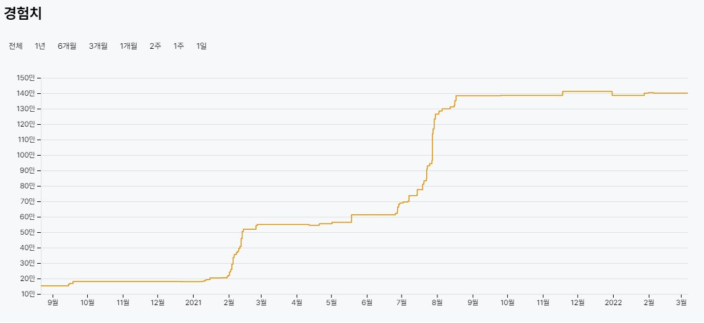

2021년을 회고하면서 한 단어로 정의하자면 **경험**이다.

벌써 2021년이 다 지나가고 2022년이 1월이 왔다. 군대를 전역한 지 1년이나 지났다는 게 믿기지 않을 만큼 정말 쏜살같이 보낸 1년이었다. 2021년은 군대를 전역한 즐거운 해기도 하지만 개발자로서의 성장을 할 수 있는 많은 경험을 한 의미 있는 해기도 하다. 벌써 기억이 흐릿하지만 캘린더와 깃허브를 참고해가며 **2021년 나의 경험에 대해 회고**를 작성해보려고 한다.

## 코테 준비 시작
12월에 조기 전역하면서 군대에서 "사회 나가면 진짜 열심히 공부해야지"라는 나의 다짐은 전역한 지 일주일 만에 사라졌다. 군대에서 잠 줄여가며 힘들게 개발 공부를 해서 그런가? 오히려 전역한 후에는 거의 코딩을 안 했던 것 같다. 그래도 뭔가 이렇게 아무것도 안 해도 되나..? 라는 생각이 들어 **이런 양심의 가책을 지우기 위해 하루에 2문제씩 백준문제 풀기로 마음먹었다.**

처음에는 혼자서 백준을 풀었는데 점점 의욕도 안나고 재미도 없어 학교 동아리 동기들과 함께 매일 아침 10시 백준풀기 스터디를 진행했다. 10시에 진행한 이유는 새벽 늦게까지 게임을 하느라 생활패턴이 엉망이기도 했고 이번 기회에 일찍 자고 일어나는 **새나라의 어린이**가 되어보자는 꿈을 가지면서 시간을 잡았다.

스터디를 진행하면서 정해진 시간에 다 같이 모여 문제를 풀고 경쟁하면서 오는 재미도 있고 혼자였다면 오늘 하루쯤은 쉬어도 되겠지라는 생각을 하면서 어영부영 넘어갔을 텐데 다른 사람과 함께이기 때문에 이런 부분에서 동기부여가 되었던 것 같다.

개강하면서 스터디는 점점 흐지부지되었지만 **함께하는 의미**와 **코테가 질리지 않게 해준 원동력**이 되었다. (~~백준 골드 4찍은 것은 덤~~)

## 소프트웨어학과 복수전공 시작

## 네이버 부스트 캠프 탈락

## 개발 스터디 시작

## 세종대-건국대 교류전

## 오픈소스 Deep Dive

### 오픈소스 사용자에서 컨트리뷰터까지

## LG전자에서의 첫 인턴

### 정신적인 성장

### 기술적인 성장

## 2022년에는 무엇을 해볼까?

### 나를 브랜딩하기

### 적어도 한달에 한개의 글쓰기

### 의식적으로 연습하기

### CS 공부하기
