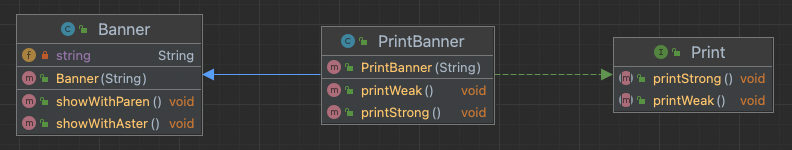
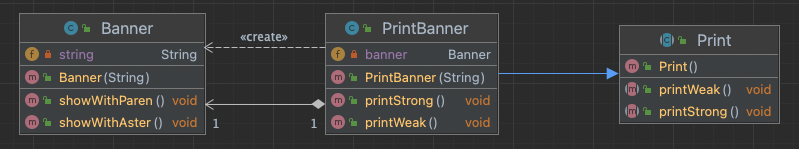
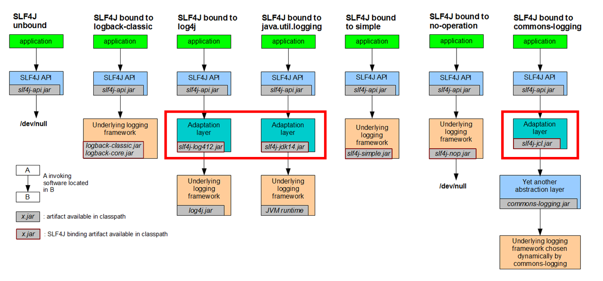

## 어댑터 패턴
110v 콘센트에 220v 기기를 사용하려고 하면 규격이 다르기 때문에 중간에 전압을 변환해주는 변압기를 사용해 규격을 맞춰줘야 합니다.

이처럼 이미 **제공되어 있는 것**(110v)과 **필요한 것**(220v) **사이의 차이**(변압기)를 없애기 위해 사용하는 패턴이 **어댑터 패턴**입니다.

## 어댑터 패턴의 구현 방법
어댑터 패턴은 아래와 같이 상속, 위임 두가지 방식으로 구현할 수 있습니다.

- 상속을 사용한 어댑터 패턴 (클래스에 의한 어댑터 패턴)
- 위임을 사용한 어댑터 패턴 (인스턴스에 의한 어댑터 패턴)

### 상속을 사용한 어댑터 패턴

#### Adaptee (이미 제공되어 있는 것)

만약 문자열을 괄호로 묶어 표시하는 showWithParen 메서드와 문자열 전후로 *를 붙여 표시하는 showWithAster 메서드가 Banner 클래스에 **이미 제공되어 있다고** 가정합니다.

```java
public class Banner {
    private String string;

    public Banner(String string) {
        this.string = string;
    }

    public void showWithParen() {
        System.out.println("(" + string + ")");
    }

    public void showWithAster() {
        System.out.println("*" + string + "*");
    }
}
```

#### Target (필요한 것)

한편 Priint 인퍼테이스는 문자열을 느슨하게 표시(괄호로 묶어 표시)하기 위한 printWeak 메서드와 문자열을 강하게 표시(*를 전후로 붙여 표시)하기 위한 printStrong 메서드가 선언되어 있다고 가정합니다. 

```java
public interface Print {
    public abstract void printWeak();
    public abstract void printStrong();
}
```

#### Adapter (사이의 차이)

여기서 Banner 클래스를 사용하여 Print 인터페이스를 충족시키는 클래스를 만들기 위해서는 Adapter의 역할을 수행하는 PrintBanner 클래스가 필요합니다.

PrinterBanner 클래스는 Banner 클래스를 상속해서 필요로 하는 Print 인터페이스를 구현합니다. 

```java
public class PrintBanner extends Banner implements Print {
    public PrintBanner(String string) {
        super(string);
    }

    // Banner 클래스의 showWithParen 메서드를 사용해 printWeak를 구현
    @Override
    public void printWeak() {
        showWithParen();
    }

    // Banner 클래스의 showWithAster 메서드를 사용해 printStrong 메서드를 구현
    @Override
    public void printStrong() {
        showWithAster();
    }
}
```

현재의 클래스 다이어그램을 살펴보면 아래와 같은 모습이 됩니다. 

PrintBanner 클래스에서 Banner를 상속받아 Banner에서 정의된 메서드(showWithParen, showWithAster)를 사용하여 Print 인터페이스에서 정의한 메서드(printStrong, printWeak)를 구현했습니다.



여기서 Main 클래스를 살펴보면 Print라는 인터페이스를 사용하여 프로그래밍을 하고 있습니다.

```java
public class Main {
    public static void main(String[] args) {
        Print p = new PrintBanner("Hello");
        p.printWeak();
        p.printStrong();
    }
}
```

하지만 Main 클래스에서 Banner 클래스나 showWithParen 메서드, showWithAster 메서드는 완전히 감추어져 있습니다. 만약 우리가 Banner가 아닌 SpecialBanner 클래스를 새로 추가해 사용한다도 해도 Main 클래스의 코드는 수정할 필요없이 Print와 SpecialBanner 사이의 어댑터만 구현해주면 됩니다. 

> 따라서 OCP(Open Closed Principle)을 만족한다고 할 수 있습니다.

### 위임을 사용한 어댑터 패턴

설명에 앞서 위임(delegation)에 대해 요약하면 ‘누군가에게 맡긴다’ 라는 의미 입니다.Java에서 위임은 어떤 메서드의 실제 처리를 다른 인스턴스의 메서드에 맡기는 것을 말합니다.

#### Adaptee (이미 제공되어 있는 것)

상속을 이용한 어댑터 패턴과 동일하게 문자열을 괄호로 묶어 표시하는 showWithParen 메서드와 문자열 전후로 *를 붙여 표시하는 showWithAster 메서드가 Banner 클래스에 **이미 제공되어 있다고** 가정합니다.

```java
public class Banner {
    private String string;

    public Banner(String string) {
        this.string = string;
    }

    public void showWithParen() {
        System.out.println("(" + string + ")");
    }

    public void showWithAster() {
        System.out.println("*" + string + "*");
    }
}

```

#### Target (필요한 것)

상속과의 차이점은 Print 클래스가 인터페이스가 아닌 클래스라는 점입니다. 메서드는 동일하게 문자열을 느슨하게 표시(괄호로 묶어 표시)하기 위한 printWeak 메서드와 문자열을 강하게 표시(*를 전후로 붙여 표시)하기 위한 printStrong 메서드가 선언되어 있다고 가정합니다.

```java
public abstract class Print {
    public abstract void printWeak();
    public abstract void printStrong();
}
```

#### Adapter (사이의 차이)

Banner 클래스를 이용해서 Print 클래스와 동일한 메서드를 갖는 클래스를 실현해야 합니다. 

하지만 Java에서는 2개의 클래스를 동시에 상속할 수 없기 때문에 PrintBanner 클래스를 Print와 Banner 모두의 하위 클래스로 정의할 수 없습니다. 

이러한 문제를 해결하기 위해 banner 필드를 추가하고 생성자를 통해 Banner 클래스의 인스턴스를 생성합니다. 여기서 만든 banner를 경유하여 showWithParen 메서드와 showWithAster를 호출하여 사용합니다.

```java
public class PrintBanner extends Print {
    private Banner banner;

    public PrintBanner(String string) {
        this.banner = new Banner(string);
    }

    @Override
    public void printWeak() {
        banner.showWithParen();
    }

    @Override
    public void printStrong() {
        banner.showWithAster();
    }
}
```

클래스 다이어그램을 살펴보면 아래와 같은 모습이 됩니다. 



이전의 상속을 사용한 어댑터 패턴과의 차이점은 상위 클래스에서 상속한 메서드를 호출하는 것이 아닌 필드를 경유하여 호출하고 있다는 점입니다. 

PrintBanner 클래스의 printWeak 메서드가 호출되었을 때, 자신이 처리하는 것이 아닌 별도의 인스턴스인 banner를 경유하여 showWithParen 메서드에게 위임하고 있는것을 확인할 수 있습니다.


상속을 이용한 방식과 마찬가지로 Main 클래스에서 Banner 클래스나 showWithParen 메서드, showWithAster 메서드는 완전히 감추어져 있습니다.

```java
public class Main {
    public static void main(String[] args) {
        Print p = new PrintBanner("Hello");
        p.printWeak();
        p.printStrong();
    }
}
```

만약 우리가 Banner가 아닌 SpecialBanner 클래스를 새로 추가해 사용한다도 해도 Main 클래스의 코드는 수정할 필요없이 Print와 SpecialBanner 사이의 어댑터만 구현해주면 됩니다. 

> 따라서 OCP(Open Closed Principle)을 만족한다고 할 수 있습니다.


## 어댑터 패턴 사용 예시
### Arrays.list, Collections.list

간단한 예시로 아래와 같이 서로 상이한 인터페이스를 변환하는 메서드도 어댑터 패턴의 예시라고 할 수 있습니다.

```java
/*
  서로 상이한 인터페이스를 변환하는 메서드
*/

// Arrays
List<String> strings = Arrays.asList("a", "b", "c");

// Collections
List<String> list = Collections.list(enumeration);
Enumeration<String> enumeration = Collections.enumeration(strings);
```

Collections.enumeration 메서드를 예시로 보면 List인 strings는 adaptee(이미 제공되어 있는 것), Enumeration이 target(필요한 것), 그 둘을 변환해주는 Collections.enumeration()이 adapter(사이의 차이)의 역할을 하며 서로 상이한 인터페이스를 변환합니다.

### SLF4J 로깅 API
SLF4J는 단일 로깅 API를 사용하면서 Java logging, log4j, LogBack 등의 로깅 프레임워크를 선택적으로 사용할 수 있도록 합니다. 

이때 SLF4J가 제공하는 인터페이스와 각 로깅 프레임워크의 인터페이스가 다르기 때문에 서로 다른 인터페이스를 맞춰 주기 위한 어댑터 패턴을 사용하고 있습니다.

아래의 사진에서 볼 수 있듯이 **SLF4J-log4j**, **SLF4J-Java logging**에서 로깅 프레임워크를 SLF4J의 인터페이스로 맞춰 주기 위해 중간에 Adaptation layer를 둔 것을 확인할 수 있습니다. 




이러한 코드는 만약 **로깅 프레임워크를 변경해도 SLF4J를 사용하는 코드는 영향받지 않고 중간에 있는 어댑터만 구현해주면 되기 때문에 개방 폐쇄 원칙(OCP)**을 따를 수 있도록 합니다.

## 참고
* [Java 언어로 배우는 디자인 패턴 입문](https://www.aladin.co.kr/shop/wproduct.aspx?ItemId=2104376)
* [코딩으로 학습하는 GoF의 디자인 패턴](https://www.inflearn.com/course/%EB%94%94%EC%9E%90%EC%9D%B8-%ED%8C%A8%ED%84%B4)
* [객체 지향과 디자인 패턴 ](https://www.aladin.co.kr/shop/wproduct.aspx?ItemId=28301535)