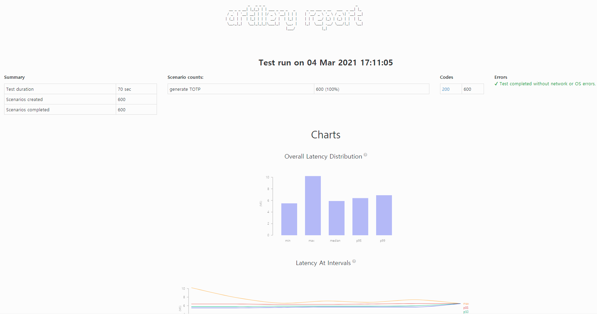

### 스트레스 테스트란?

부하를 처리하는 데 충분한 리소스를 갖추지 않은 상태에서 잠재적으로 손해를 끼칠 수 있는 오류를 찾기 위해 임계점까지 스트레스를 가하는 테스트입니다.

### 준비

- node.js LTS 버전 설치

### Artillery

우선 Artillery는 node.js로 작성된 스트레스 테스트 도구입니다. HTTP, [Socket.io](http://socket.io), WebSocket 등 다양한 프로토콜을 지원하고 클라이언트의 시나리오대로 테스트를 진행할수도 있습니다.

[Artillery.io | Load & Smoke Testing](https://artillery.io/)

### 설치

npm 명령어를 통해 artillery를 설치해줍니다. (1.6버전은 현재 stable release입니다.)

```matlab
npm install -g artillery@1.6
```

간단한 요청같은 경우는 아래의 명령으로 테스트를 진행할 수 있습니다.

```matlab
artillery quick --count 10 -n 20 localhost:8080 // 10명의 가상 사용자가 20번 요청
```

위의 요청에 대한 응답은 아래와 같습니다. Response time을 보면 min, max, midian, p99, p95의 응답시간을 알려줍니다.

```matlab
Started phase 0, duration: 1s @ 16:28:04(+0900) 2021-03-04
Report @ 16:28:06(+0900) 2021-03-04
Elapsed time: 1 second
  Scenarios launched:  10
  Scenarios completed: 10
  Requests completed:  200
  Mean response/sec: 144.93
  Response time (msec):
    min: 1.7
    max: 9.1
    median: 2.5
    p95: 4.2
    p99: 4.9
  Codes:
    404: 200

All virtual users finished
Summary report @ 16:28:06(+0900) 2021-03-04
  Scenarios launched:  10
  Scenarios completed: 10
  Requests completed:  200
  Mean response/sec: 143.88
  Response time (msec):
    min: 1.7
    max: 9.1
    median: 2.5
    p95: 4.2
    p99: 4.9
  Scenario counts:
    0: 10 (100%)
  Codes:
    404: 200
```

위와 같이 명령어로 간단한 테스트를 진행할 수 있지만 yml, json으로 된 설정 파일을 통해 구체적인 테스트를 진행 할 수 있습니다.

### 테스트 시나리오 설정

Artillery Documentation에서 테스트 시나리오 예시를 제공하고 있습니다. ([참고](https://artillery.io/docs/guides/getting-started/core-concepts.html#Putting-it-all-together))

### test.yml

```matlab
config:
  target: "http://localhost:8080"
  phases:
    - duration: 60        // 테스트 시간(초)
      arrivalRate: 100    // 초당 늘어나는 가상 사용자 수
      name: Warm up
scenarios:
  # We define one scenario:
  - name: "generate TOTP"
    flow:
      - get:
          url: "/api/totp/transfer/qrcode/1"
```

아래의 명령어를 통해 테스트 시나리오를 실행시키고 결과를 json 형태로 저장할수 있습니다.

```matlab
artillery.cmd run --output report.json .\test.yml
```

하지막 아직까지는 보기 힘든 json 형식이기 때문에 아래의 명령어를 통해 html로 보기 좋게 변환 할 수 있습니다.

```matlab
artillery.cmd report .\report.json
```

