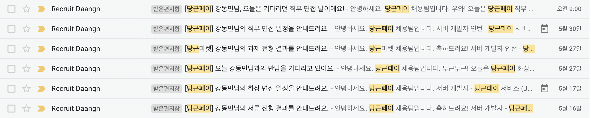
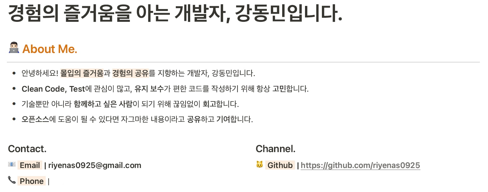
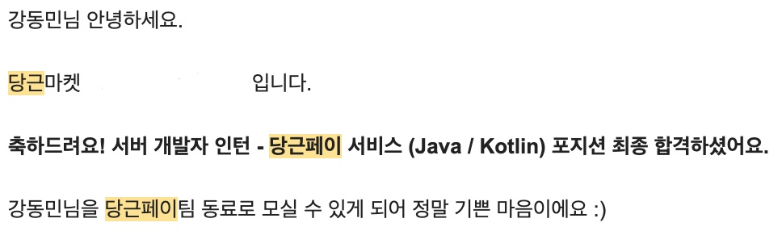

당근페이 서버개발자 인턴십 채용 프로세스가 끝났습니다. 두번째 면접이라 부족한 점도 많았고 아쉬운 것도 많았지만 면접을 진행하면서 배운것도 많아 기록으로 남기려고 합니다.

이전에 인턴을 하면서 안정적인 서비스를 유지보수하고 새로운 기능을 개발하는 업무를 하면서도 많은 것을 배웠지만 이런 안정적인 곳 보다는 스타트업과 같이 빠르게 성장하는 곳에서 기술적으로 성장하고 싶다는 고민을 하기도 했고, 개발자들에게 평이 좋은 당근마켓에서 개발을 하고 싶다는 막연한 호기심에 정규직 전형을 넣었습니다.

### 채용 프로세스

제가 지원한 당근페이 서비스팀 정규직 전형은 서류 → 화상면접 → 직무 면접 → 컬쳐핏 면접 으로 이루어졌습니다. 저의 경우는 중간에 인턴십 전형으로 변경되어 서류 → 화상 면접 → 직무 면접 으로 이루어졌습니다.

### 서류 전형

작년말 부터 틈틈히 지원하면서 이력서를 준비해왔기 때문에 Notion으로 만들어진 이력서를 PDF로 변환해서 제출했습니다.

서류의 경우 금요일 접수했는데 월요일에 바로 결과가 나올정도로 빠르게 진행되었습니다!

### 화상 면접

화상면접은 **1대1로 화상**을 통해 이루어졌고 **1시간 정도 진행**했습니다.

저의 경우는 **이력서 기반의 질문**과 **JAVA, Spring, Network, Database에 대한 전반적인 CS지식**을 물어봤습니다. 면접 진행은 꼬리질문을 통해 진행되었는데 저는 2문제 정도 모르는 질문이 나왓지만 조금 시간의 걸리더라도 최대한 제가 생각하는 답안을 말하려고 했습니다.

마지막 질문에서는 당근페이팀이 어떻게 일하는지에 대해서 질문했는데 어떤 개발 문화를 가지고 있는지 어떻게 소통하는지 들으면서 당근 페이 개발팀의 문화를 엿볼 수 있었습니다.

기술 면접을 처음이라 처음에 많이 긴장했었는데 면접관님이 물 마시면서 긴장하지 말고 편하게 면접봐도 된다고 하시는 말을 듣고 조금은 긴장이 풀렸던 것 같습니다.

### 인턴십 전형으로

화상 면접을 본 다음 정규직 전형에서 인턴십 전형으로 변경해 진행하자는 연락을 받았습니다. 아직 정규학기가 남아있기도 하고 정규직 채용 프로세스보다는 인턴십 채용 프로세스가 저에게 더 어울릴 것 같아 인턴십 전형으로 남은 채용 프로세스를 진행하기로 했습니다. 지원자의 상황에 맞게 유동적으로 채용 프로세스를 전환한다는 점이 인상깊었습니다.

### 직무 면접

직무면접은 **3대 1로 화상**을 통해 이루어졌고 **1시간 40분 정도 진행**했습니다.

화상 면접때와는 다르게 기초적인 CS질문보다는 주어진 상황에서 **어떤 기술적 방안을 이용해 해결할 수 있을지?**, **해결방안을 제시했다면 왜 그렇게 제시했는지?** 등을 중점적으로 질문하셨고 이력서 기반, 기술 질문, 인성 질문 등 전반적인 분야에 대해서 질문을 하셨습니다.

특히 면접을 보면서 받은 기술적인 질문들은 면접이 끝나고 나서 조금 더 고민해보고 싶다는 생각이 들 정도로 많은 생각이 담긴 질문들이 나왔습니다. **정답이 없는 질문**이기 때문에 지원자가 어떤 **생각**을 가지고 **고민**하고 있는지를 보시는 것 같았습니다.

화상 면접과 동일하게 면접관분들이 지원자가 모든 역량을 발휘할 수 있도록 편안한 분위기로 면접을 진행하셨고 이런 분위기 때문인지는 몰라도 긴장이 풀린 순간부터는 제가 개발을 하면서 배우고 느낀점에 대해서 솔직하게 답변할 수 있었던 것 같습니다.

### 당근페이 인턴으로

정말 감사하게도 제 성장 가능성을 좋게 봐주셔서 당근페이 서비스 팀에서 3개월간 인턴으로 합류하게 되었습니다!

### 무엇을 느꼈을까?

면접을 준비하면서 면접후기들을 찾아보면 모두들 “**당근마켓의 면접경험이 좋았다!**” 라고 말하고 있었습니다. 글들을 읽으면서 면접 경험이 좋다는 의미가 뭐지…? 이런 의문을 가지고 면접을 봤습니다.

면접을 보고나서 든 생각은 지원자의 역량을 최대한 끌어올리기 위해 많은 노력을 하고 지원자는 그런 **편안한 환경에서 자신의 역량을 최대로 보여줄 수 있다는 점이었습니다.**

그리고 기술 면접을 통해 제가 미쳐 알지 못했던 **실무적인 고민에 대해 생각해 볼 수 있어서 좋았습니다**. 지금까지 개발을 하면서 이런 실무적인 고민에 대해 해볼 수 있는 기회가 적어 아쉽다는 생각이 들었는데 면접 질문에 대해서 답변하고 다시 질문을 받는 과정을 통해 기술적인 고민에 대해서 조금 더 생각해보면서 기술적인 부분에 대한 고민을 엿볼 수 있었습니다.

---

**두 번째로 겪은 채용 프로세스였지만 정말 많은 것을 배울 수 있는, 또 많은 생각을 해볼 수 있는 좋은 면접 경험이었다고 생각합니다.**