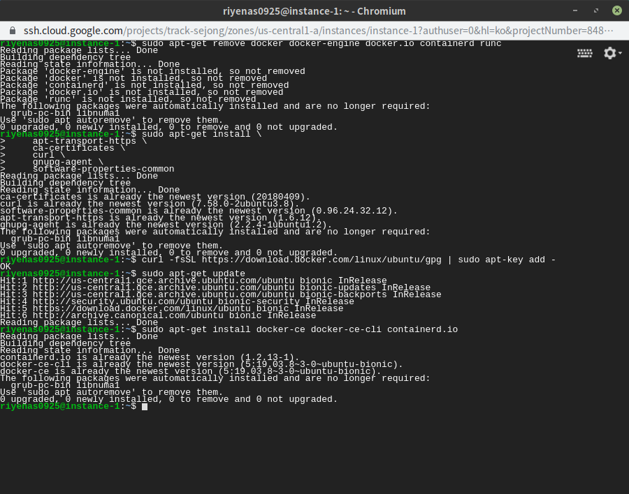
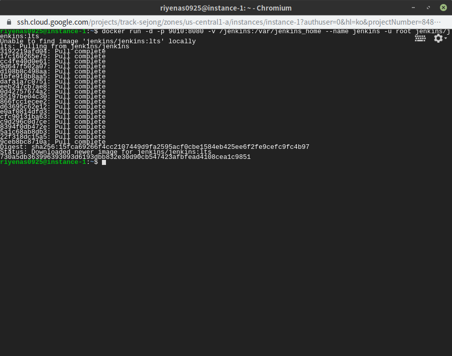
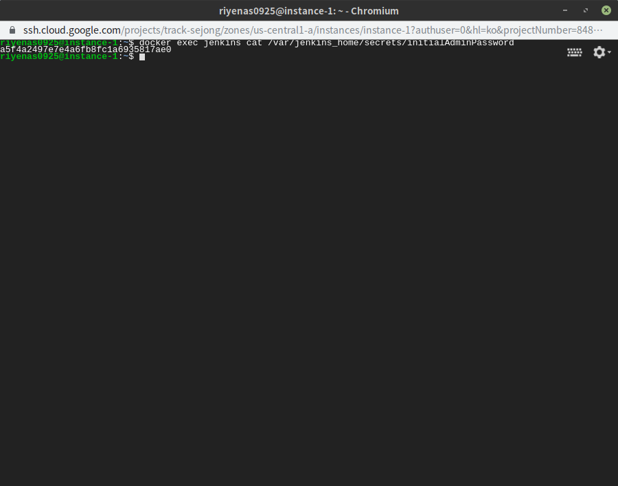
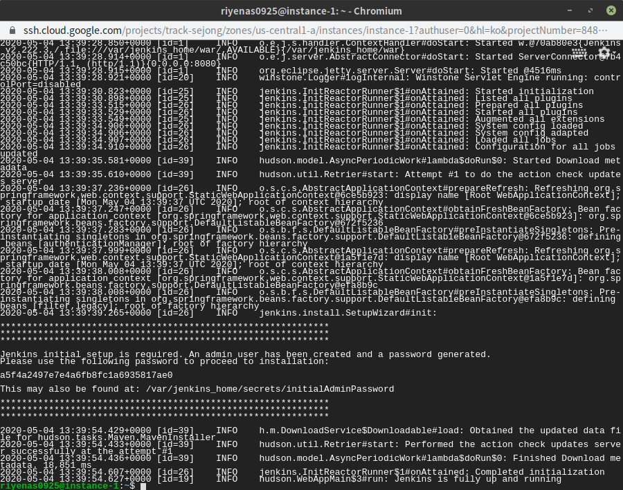

Docker를 이용해 Jenkins를 설치하면서 배운 내용을 정리한 글입니다

## Docker 설치 환경

- Cloud Flatform : Google Cloud Platform
- OS : Ubuntu 18.04.4
- Jenkins Port : 9010

## Docker 설치

[https://docs.docker.com/engine/install/ubuntu/](https://docs.docker.com/engine/install/ubuntu/)

```bash
# Uninstall old version
sudo apt-get remove docker docker-engine docker.io containerd runc

# Install using the repository
sudo apt-get update
~~s~~udo apt-get install \
    apt-transport-https \
    ca-certificates \
    curl \
    gnupg-agent \
    software-properties-common

curl -fsSL https://download.docker.com/linux/ubuntu/gpg | sudo apt-key add -

#DOCKER ENGINE 설치
*s*udo add-apt-repository "deb [arch=amd64] https://download.docker.com/linux/ubuntu bionic stable"
sudo apt-get update
sudo apt install docker-ce
```



## sudo 없이 docker명령어 사용하기

```bash
sudo usermod -aG docker $USER
```

## Jenkins 구동하기

```bash
docker run -d -p 9010:8080 -v /jenkins:/var/jenkins_home --name jenkins -u root jenkins/jenkins:lts
docker run -d --restart=always -p 9010:8080 -v /jenkins:/var/jenkins_home --name jenkins -u root jenkins/jenkins:jdk11
```



## Jenkins 초기 비밀번호 확인

### 방법 1. exec 명령어로 컨테이너를 접속해서 확인

```bash
docker exec jenkins cat /var/jenkins_home/secrets/initialAdminPassword
```



### 방법 2. docker logs를 이용하여 확인

```bash
$ docker logs jenkins
```

