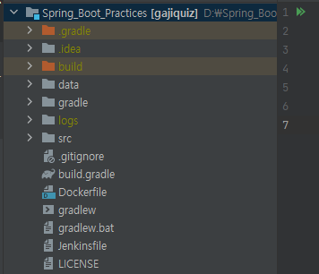
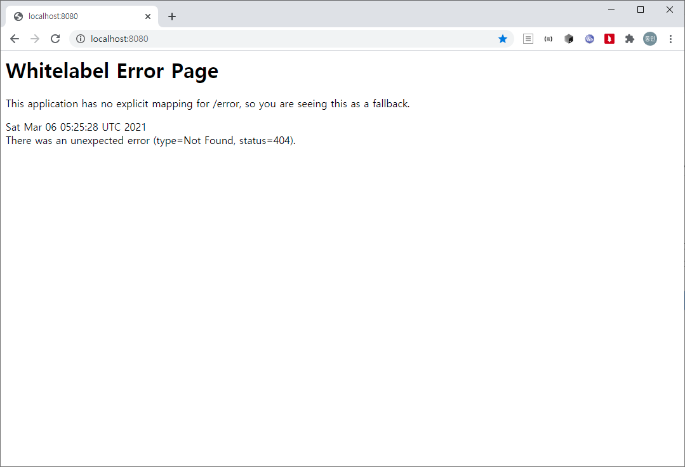

jenkins로 배포를 해보려고 하던중에 평소처럼 .jar이나 .war로 배포하는 방식이 아니라 docker 이미지로 만들어서 컨테이너로 배포해보고 싶어서 스프링 부트 애플리케이션을 docker 이미지로 만드는 방법을 정리한 글입니다. ([참고](https://spring.io/guides/gs/spring-boot-docker/))

## Dockerfile

우선 Docker 이미지를 만들기 위해서는 컨테이너의 구성 정보를 명시해주기 위한 파일인 Dockerfile을 root 디렉토리에 만들어 줘야합니다.



### 예시

```matlab
FROM openjdk:11
ARG JAR_FILE=build/libs/gajiquiz-0.0.1-SNAPSHOT.jar
COPY ${JAR_FILE} gaji-quiz.jar
ENTRYPOINT ["java","-jar","/gaji-quiz.jar"]
EXPOSE 8080
```

**FROM** 명령어는 스프링 부트 애플리케이션이 돌아갈 베이스 이미지를 의미합니다. 여기서는  openjdk11을 사용하고 있으니 아래와 같이 설정해주면 됩니다. 베이스 이미지는 [docker hub](https://hub.docker.com/)에서 찾아 사용할 수 있습니다.

```matlab
FROM openjdk:11
```

**ARG** 명령어로 jar 파일의 위치를 정해줍니다.

```matlab
ARG JAR_FILE=build/libs/gajiquiz-0.0.1-SNAPSHOT.jar
```

**COPY** 명령어로 위의 경로에 있는 jar 파일을 gaji-quiz.jar이라는 이름으로 복사해줍시다.

```matlab
COPY ${JAR_FILE} gaji-quiz.jar
```

**ENTRYPOINT**는 애플리케이션을 실행시킬 명령어 입니다. 만약 명령어가 **java -jar ./gaji-quiz.jar**이라면 아래와 같이 작성하면 됩니다.

```matlab
ENTRYPOINT ["java","-jar","/gaji-quiz.jar"]
```

**EXPOSE**는 애플리케이션이 사용하는 포트를 적어주면 됩니다. 스프링 부트는 기본적으로 8080포트를 사용하기 때문에 아래처럼 추가해주면 됩니다

```matlab
EXPOSE 8080
```

## Docker Image 만들기

이제 Dockerfile 작성을 끝내고 이미지를 만들어 봅시다. 우선 docker 이미지를 만들때 jar 파일이 필요하기 때문에 아래의 명령어로 jar파일을 생성해야 합니다.

```matlab
./gradle clean build
```

이때 jar파일이 생성된 위치와 Dockerfile에서 ARG로 정해준 위치가 동일해야 합니다!!

jar 파일이 생성되었으면 아래 명령어를 통해 docker 이미지를 생성할 수 있습니다. 기본적으로 태그 이름은 **저장소 이름/이미지 이름:태그 이름** 형식 입니다. 여기서는 태그는 따로 정하지 않도록 하겠습니다.

```matlab
docker build -t riyenas0925/gaji-quiz .
```

위의 명령어를 실행시키면 아래와 같이 docker 이미지가 생성되는 것을 확인 할 수 있습니다.

```matlab
docker build -t riyenas0925/gaji-quiz .
[+] Building 1.1s (7/7) FINISHED
 => [internal] load build definition from Dockerfile                                                                                                                                                                               0.0s
 => => transferring dockerfile: 32B                                                                                                                                                                                                0.0s
 => [internal] load .dockerignore                                                                                                                                                                                                  0.0s
 => => transferring context: 2B                                                                                                                                                                                                    0.0s
 => [internal] load metadata for docker.io/library/openjdk:11                                                                                                                                                                      1.0s
 => [internal] load build context                                                                                                                                                                                                  0.0s
 => => transferring context: 117B                                                                                                                                                                                                  0.0s
 => [1/2] FROM docker.io/library/openjdk:11@sha256:3805f5303af58ebfee1d2f5cd5a897e97409e48398144afc2233f7b778337017                                                                                                                0.0s
 => CACHED [2/2] COPY build/libs/gajiquiz-0.0.1-SNAPSHOT.jar gaji-quiz.jar                                                                                                                                                         0.0s
 => exporting to image                                                                                                                                                                                                             0.0s
 => => exporting layers                                                                                                                                                                                                            0.0s
 => => writing image sha256:f431b4f522d7c7b514c804bac5621e991592a22907bfb9719bc0f92be5a6e290                                                                                                                                       0.0s
 => => naming to docker.io/riyenas0925/gaji-quiz
```

이제 docker run 명령어로 docker 이미지를 컨테이너로 올려서 애플리케이션이 작동되는지 확인해 봅시다.

```matlab
docker run -p 8080:8080 -it riyenas0925/gaji-quiz
```

실행하면 아래처럼 정상적으로 애플리케이션이 동작 될것입니다. 



하지만 데이터베이스를 사용하는 애플리케이션이라면 데이터베이스를 찾을수 없다는 오류를 띄울겁니다. 그렇다면 데이터 베이스를 사용하는 스프링 부트 애플리케이션은 어떻게 docker에 띄울수 있을까요? 

이것은 **docker-compose**를 이용하여 컨테이너를 묶는것으로 해결 할 수 있습니다. 이 방식은 다음 글에서 배워 봅시다.