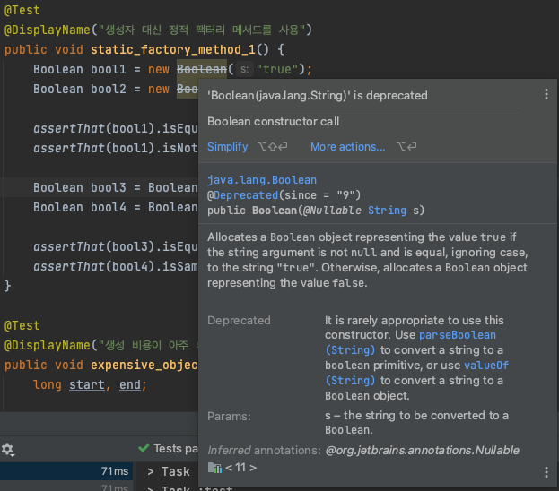

## 생성자대신 문자열 리터럴

똑같은 기능의 객체를 매번 생성하기보다는 객체 하나를 재사용하는 편이 나을때가 많다 재사용은 빠르고 세련되다.

### new 연산자를 이용한 문자열 생성

아래의 예시를 보면 매번 실행될 때마다 String 인스턴스를 새로 만든다. 이러한 방식은 **반복문이나 빈번히 호출되는 메서드 안에 있다면 String 인스턴스를 수백만개 만들**어질 수도 있다.

```java
@Test
@DisplayName("매번 새로운 객체를 생성")
public void string_1() {
    String s1 = new String("apple");
    String s2 = new String("apple");

    assertThat(s1).isEqualTo(s2);   // 값이 동일하기 때문에 true
    assertThat(s1).isNotSameAs(s2); // 매번 새로운 인스턴스를 만들기 때문에 true
}
```

### 문자열 리터럴 생성

하지만 위의 코드를 아래처럼 바꾸면 새로운 인스턴스를 매번 만드는 대신 하나의 String 인스턴스를 사용한다. 나아가 이 방식을 사용한다면 **같은 가상 머신 안에서 이와 똑같은 문자열 리터럴을 사용하는 모든 코드가 같은 객체를 재사용함이 보장**된다.

```java
@Test
@DisplayName("문자열 리터럴을 사용하는 모든 코드가 하나의 인스턴스를 재사용")
public void string_2() {
    String s3 = "apple";
    String s4 = "apple";

    assertThat(s3).isEqualTo(s4);  // 값이 동일하기 때문에 true
    assertThat(s3).isSameAs(s4);   // 같은 인스턴스를 재사용하기 때문에 true
}
```

## 생성자 대신 정적 팩터리 메서드

**생성자 대신 정적 팩터리 메서드를 제공하는 불변 클래스에서는 정적 팩터리 메서드를 사용해 불필요한 객체 생성을 피할 수 있다.** 생성자는 호출할때마다 새로운 객체를 만들지만 정적 팩터리 메서드를 사용한다면 불변 객체만이 아니라 가변 객체라 해도 사용 중에 변경되지 않을 것임을 안다면 재사용 할 수 있다.

```java
@Test
@DisplayName("생성자 대신 정적 팩터리 메서드를 사용")
public void static_factory_method_1() {
		// 생성자 사용
    Boolean bool1 = new Boolean("true");
    Boolean bool2 = new Boolean("true");

    assertThat(bool1).isEqualTo(bool2);
    assertThat(bool1).isNotSameAs(bool2); // 새로운 객체가 생성되었기 때문에 true

		// 정적 팩터리 메서드 사용
    Boolean bool3 = Boolean.valueOf("true");
    Boolean bool4 = Boolean.valueOf("true");

    assertThat(bool3).isEqualTo(bool4);
    assertThat(bool4).isSameAs(bool4);   // 객체를 재사용하기 때문에 true
}
```

> 자바 9에서는 Boolean(String)d이 deprecated API로 지정되었다.
> 



## 생성 비용이 비싼 객체

예를 들어 주어진 문자열이 유효한 로마 숫자인지를 확인하는 메서드를 작성한다고 해보자. 아래는 정규표현식을 활용한 가장 쉬운 해법이다. 하지만 String.matches 메서드를 사용하면 **내부에서 만드는 정규표현식용 Pattern 인스턴스가 한 번 쓰고 버려져서 곧바로 가비지 컬렉션 대상**이 된다. Pattern은 정규표현식에 해당하는 유한 상태 머신을 만들기 때문에 인스턴스 생성 비용이 많다.

```java
static boolean isRomanNumeralOld(String s) {
		// String.matches 내부에서 매번 Pattern 인스턴스를 만들어짐
    return s.matches(
            "^(?=.)M*(C[MD]|D?C{0,3})"
                    + "(X[CL]|L?X{0,3})(I[XV]|V?I{0,3})$"
    );
}
```

따라서 성능을 개선하려면 정규표현식을 표현하는 Pattern인스턴스를 초기화(정적 초기화) 과정에서 직접 생성해 캐싱해두고 나중에  isRomanNumeralNew가 호출될 때마다 이 인스턴스를 재사용 한다.

```java
private static final Pattern ROMAN = Pattern.compile(
        "^(?=.)M*(C[MD]|D?C{0,3})"
                + "(X[CL]|L?X{0,3})(I[XV]|V?I{0,3})$"
);

static boolean isRomanNumeralNew(String s) {
    return ROMAN.matcher(s).matches();
}
```

실제 아래와 같은 테스트 코드로 테스트 해보면 전자의 방식은 0.027ms 후자의 방식은 0.002ms가 나오는 것을 확인 할 수  있다. 또한 후자의 방식으로 하면 코드도 더 명확해졌다. 개선 전에는 존재조차 몰랐던 Pattern 인스턴스를 static final 필드로 끄집어내고 이름을 지어주어 코드의 의미가 훨씬 잘 들어나다.

```java
@Test
@DisplayName("생성 비용이 아주 비싼 객체")
public void expensive_object() {
    long start, end;

    start = System.currentTimeMillis();

    for(int i = 0; i < 1000; i++) {
				// 캐싱 사용 X
        isRomanNumeralOld("LXXXVIII");
    }

    end = System.currentTimeMillis();
    System.out.println((end - start) / 1000.0 + "ms");

    start = System.currentTimeMillis();

    for(int i = 0; i < 1000; i++) {
				// 캐싱 사용
        isRomanNumeralNew("LXXXVIII");
    }
    end = System.currentTimeMillis();
    System.out.println((end - start) / 1000.0 + "ms");
}
```

## 오토 박싱

> 오토 박싱은 프로그래머가 기본 타입과 박싱된 기본 타입을 섞어 쓸 때 자동으로 상호 변환해주는 기술
> 

오토박싱은 기본 타입과 그에 대응하는 박싱된 기본 타입의 구분을 흐려주지만 완전히 없애주는 것은 아니다. 의미상으로는 별 다를게 없지만 성능상으로는 크게 차이가 난다.  

아래의 예시를 보자. 모든 양의 정수의 총합을 구하는 메서드로 int는 충분히 크지 않으니 long을 사용해 계산하고 있다.

```java
static long sumOld() {
    Long sum = 0L;
    for (long i = 0; i < Integer.MAX_VALUE; i++) {
        sum += i;
    }

    return sum;
}
```

이 프로그램은 정확한 답을 내지만 제대로 구현했을 때보다 느리다. sum 변수를 long이 아닌 Long으로 선언해서 불필요한 Long 인스턴스가 생성되기 때문이다. 

```java
static long sumNew() {
    long sum = 0;
    for (long i = 0; i < Integer.MAX_VALUE; i++) {
        sum += i;
    }

    return sum;
}
```

위의 코드처럼 sum의 자료형을 long으로 변경한다면 기존에 5.689s가 걸리던 프로그램이 0.797s로 실행 시간이 빨라지게 된다.

```java
@Test
@DisplayName("오토박싱에 의한 객체 생성")
public void autoboxing() {
    long start, end;
		
		// 오토박싱 발생
    start = System.currentTimeMillis();

		sumOld();

    end = System.currentTimeMillis();
    System.out.println((end - start) / 1000.0 + "s");

		// 오토박싱 발생 X
    start = System.currentTimeMillis();

		sumNew();

    end = System.currentTimeMillis();
    System.out.println((end - start) / 1000.0 + "s");
}
```

여기 확인 할 수 있는 교훈은 명확하다 **박싱된 기본 타입보다는 기본 타입을 사용하고, 의도치 않은 오토방싱이 숨어들지 않도록 주의하자.**

## 정리

- **이번 아이템은 객체 생성은 비싸니 피해야 한다로 오해하면 안된다.** 요즘의 JVM에서는 별다른 일을 하지 않는 작은 객체를 생성하고 회수하는 일이 크게 부담되지 않는다. **프로그램의 명확성, 간결성, 기능을 위해서 객체를 추가로 생성하는 것이라면 일반적으로 좋은 일이다.**
- **아주 무거운 객체가 아닌 다음에야 단순히 객체 생성을 피하고자 여러분만의 객체 풀을 만들지 말자**. 물론 객체 풀을 만드는 게 나은 예가 있다. 데이터 베이스 연결 같은 경우는 생성 비용이 워낙 비싸니 재사용 하는 편이 낫다. 하지만 일반적으로 **자체 객체 풀은 코드를 헷갈리게 만들고 메모리 사용량을 늘리고 성능을 떨어뜨린다.**

> 요즘 JVM의 가비지 컬랙터는 상당히 잘 최적화 되어서 가벼운 객체용을 다룰 때는 직접 만든 객체 풀보다 훨씬 빠르다.
>