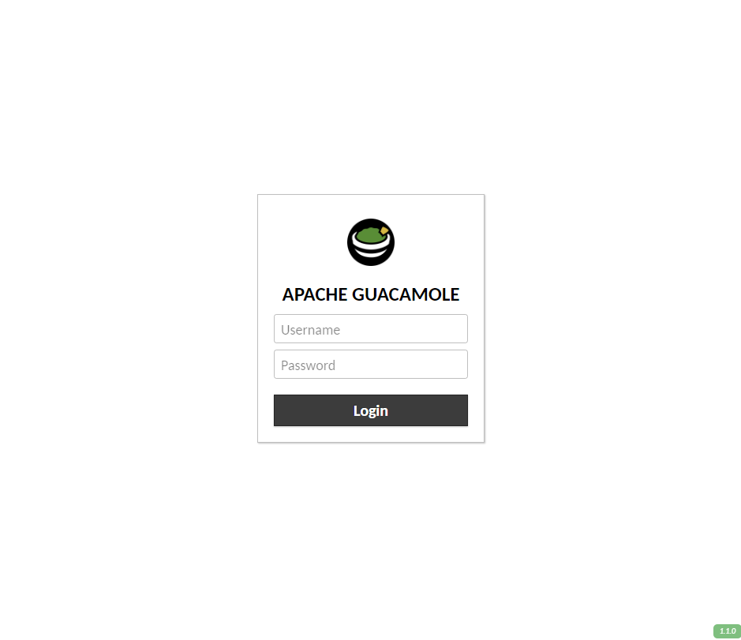
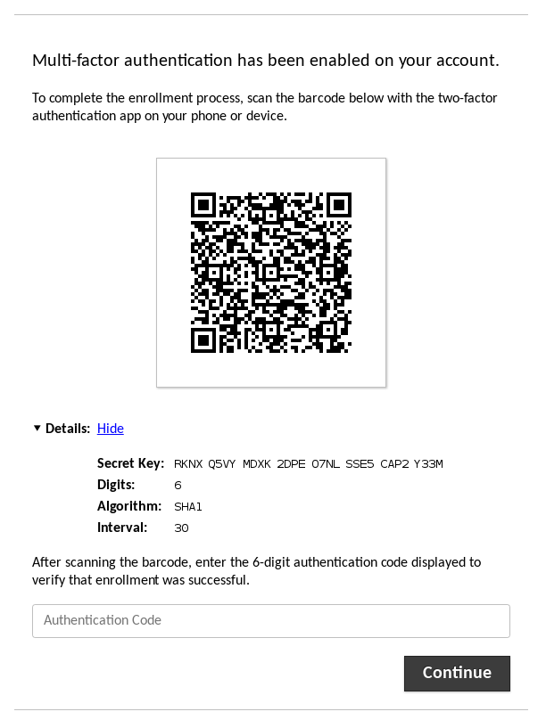
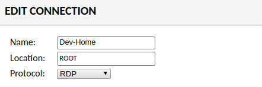
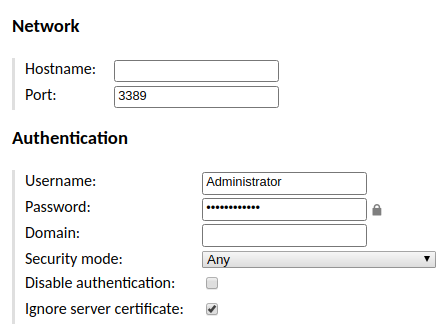
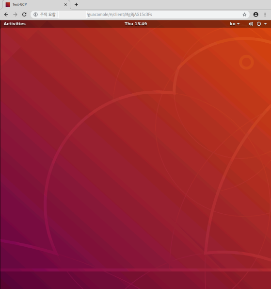

Chrome 원격 데스크탑과 Windows 기본 원격 데스크탑을 사용하지 못하는 환경에서 RDP를 사용하기 위한 HTML5 기반 클라이언트가 필요없는 데스크탑 프로그램인 Apache Guacamole 설치글입니다.

## 글쓴이가 처한 상황

- 3389포트가 막혀있음 (RDP 사용 제한)
- 레지스트리 변경이 제한됨 (RDP 포트를 다른 포트로 변경할수 없음)
- 8080, 3389 등등 많은 포트가 제한되어 있음 (80번 포트로만 연결가능)

## 설치 환경

설치환경은 GCP에 Ubuntu 18.04를 올려 진행했습니다

- Google Cloud Faltform
- Ubuntu 18.04

## Guacamole 설치

### 설치 스크립트를 이용하여 설치

우선 간편하게 설치하기 위해 MysticRyuujin이라는 개발자가 만든 우분투용 설치스크립트를 사용합니다.

[MysticRyuujin/guac-install](https://github.com/MysticRyuujin/guac-install)

파일을 다운받고 파일이름을 [guac-install.sh](http://gua-install.sh)로 변경한다음 실행권한을 부여하여 실행합니다.

```bash
wget https://git.io/fxZq5
cp fxZq5 guac-install.sh
chmod +x guac-install.sh
sudo ./guac-install.sh
```

중간중간 MySQL 비밀번호를 설정하고 몇분간 기다리면 설치가 완료되었다고 나옵니다. 처음 주소는 [localhost:8080/guacamole](http://localhost:8080/guacamole) 입니다. 여기서 저는 GCP에 설치하였기 때문에 [localhost](http://localhost)가 아닌 private ip로 접속하였습니다.

처음 접속하면 다음과 같은 화면이 뜨게됩니다.



초기 아이디, 비밀번호는  guacadmin, guacadmin 입니다. 우선 접속을 해보면 다음과 같은 화면과 함께 인증를 하라고 하는데 우선 인증을 하기에는 너무 귀찮기 때문에 한번 넘겨봅시다...!



### Guacamole Two Factor Authentication 넘기기

우선 extensions에 있는 guacamole-auth-totp-1.1.0.jar를 삭제합니다.

```bash
sudo rm -f /etc/guacamole/extensions/guacamole-auth-totp-1.1.0.jar
```

아래와 같이 guacd를 재시작하고 ubuntu도 재시작 해줍니다.

```bash
sudo /etc/init.d/guacd restart
```

## Nginx로 Reverse Proxy 설정하기

아직까지 Guacamole는 8080포트를 사용하기 때문에 글쓴이의 환경에서는 접속이 안됩니다 ㅠㅠ

Nginx에서 Reverse Proxy를 사용해 80포트로 접속할수 있게 변경해 봅시다.

```bash
sudo apt-get install nginx

sudo vi /etc/nginx/sites-available/default
```

아래와 같이 location 부분을 수정하면 됩니다. proxy_pass에는 연결하고 싶은 내부 ip나 주소를 입력하면 끝!

```bash
location / {
        proxy_pass http://localhost:8080;
        #proxy_pass http://naver.com;
        proxy_http_version 1.1;
        proxy_set_header Upgrade $http_upgrade;
        proxy_set_header Connection 'upgrade';
        proxy_set_header Host $host;
        proxy_cache_bypass $http_upgrade;
}
```

nginx를 재시작 해줍니다.

```bash
**sudo** /etc/init.d/nginx restart
```

## Ubuntu로 RDP 테스트 해보기

일단 우선 현재 GCP에 접속해있는 Ubuntu 18.04에 xrdp를 설치해서 테스트 해봅시다.

### xrdp 설치하기

```bash
sudo apt-get update 
sudo apt-get install -y xrdp 
sudo service xrdp restart 
```

### Ubuntu server에 Desktop gui  설치

GCP에서 제공하는 이미지는 ubuntu 서버이기 때문에 아래와 같이 Desktop gui를 설치해줘야 합니다.

```bash
sudo apt-get update
sudo apt-get upgrade
apt-get install ubuntu-desktop

startx
```

### id, password 설정하기

id 명령어를 통해 현제 계정이름을 찾은다음 passwd명령어를 이용하여 비밀번호를 설정합니다.

```bash
id
sudo passwd {위에서 찾은 id}
```

## Guacamole로 Ubuntu RDP로 접속하기

### Guacamole Connection 설정

Connection 에서 Hostname에는 연결하려는 주소를 넣고 Username과 Password는 자동 로그인을 위해 접속하고 싶은 데스크탑의 id, password를 입력합니다.






Home에서 설정한 Connection으로 접속하면 다음과 같은 화면이 나오게 됩니다.



## 이걸로 할 수 있는 것?!

- 80포트가 막힌곳은 거의 없기 때문에 어디서든지 RDP를 사용하여 접속할수 있다!