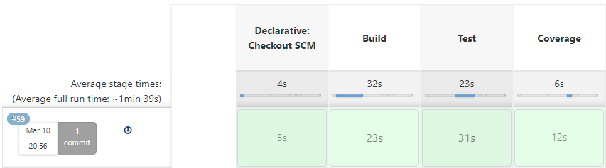
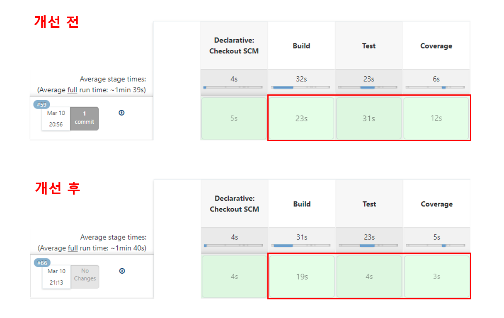

### 환경

-   XCP-ng Server(XenServer)
-   vCPU 1
-   RAM 1GB
-   Ubuntu 18.04



빌드하고 테스트 속도가 너무 늦게 나와서 속도를 개선할 방법이 없을까 하다가 우연히 Build 단계의 로그를 확인해 봤는데 **subsequent builds will be faster** 라는 log가 있었습니다.

```bash
+ chmod +x ./gradlew
+ ./gradlew clean build --exclude-task test
Starting a Gradle Daemon (subsequent builds will be faster)
&gt; Task :cleanQuerydslSourcesDir
&gt; Task :clean UP-TO-DATE
&gt; Task :initQuerydslSourcesDir
...
```

그래서 **subsequent builds will be faster** 라는 키워드로 찾아봤더니 아래처럼 항상 gradle daemon을 켜두는 설정으로 빌드 속도를 빠르게 할 수 있다고 합니다.

## Gradle Daemon 설정

.gradle/gradle.properties에 아래 설정을 추가하면 됩니다.

```bash
org.gradle.daemon=true
```

## Gradle JVM heap 설정

이전 설정에 아래와 같이 jvm heap 크기를 자신의 환경에 맞게 설정해줍시다.

```bash
org.gradle.jvmargs=-Xmx2048m -XX:MaxPermSize=512m -XX:+HeapDumpOnOutOfMemoryError -Dfile.encoding=UTF-8
org.gradle.configureondemand=true
org.gradle.parallel=true
org.gradle.caching=true
```

일반적으로 로컬에서 사용하시는 분들은 여기까지만 진행하시면 됩니다.

## Docker에 설치되어 있을때

저는 jenkins가 docker에 설치되어 있기 때문에 도커 볼륨을 통해 도커 내부에 있는 .gradle 폴더와 연결하고 그 폴더에 **gradle.properties**를 생성해 설정했습니다.

```docker
jenkins:
    image: jenkins/jenkins:jdk11
    container_name: jenkins
    user: root
    volumes:
      - ./jenkins/jenkins_home:/var/jenkins_home
      - /var/run/docker.sock:/var/run/docker.sock
      - /usr/bin/docker:/usr/bin/docker
      - ./.gradle:/root/.gradle
```

그리고 아래와 같이 도커 내부에 있는 **gradle.properties** 파일 위치를 **Dgradle.user.home=$HOME/.gradle** 명령어로 설정해 도커 볼륨에 생성한 **gradle.properties**를 사용하게 했습니다.

```bash
./gradlew clean build --exclude-task test -Dgradle.user.home=$HOME/.gradle
```

## 개선 결과

무려 71초가 걸리던 게 30초로 개선된 것을 확인할 수 있습니다!



## 참고
* [https://engineering.linecorp.com/ko/blog/how-to-make-android-app-build-faster/](https://engineering.linecorp.com/ko/blog/how-to-make-android-app-build-faster/)