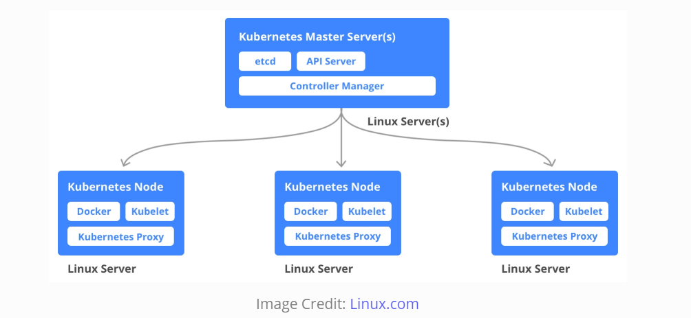
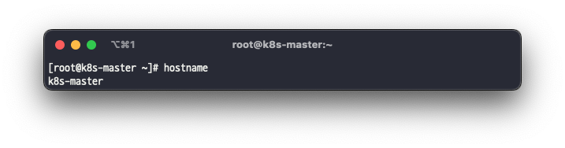
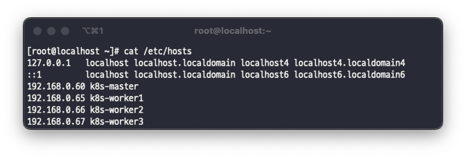
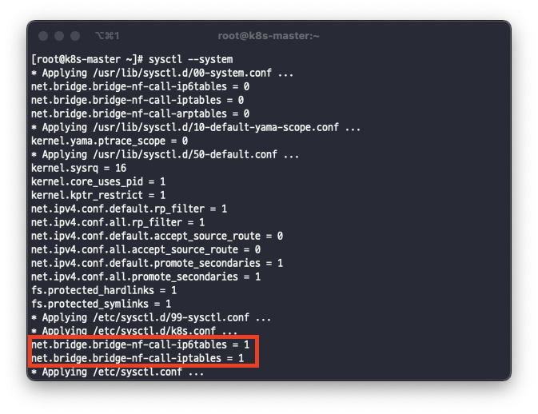
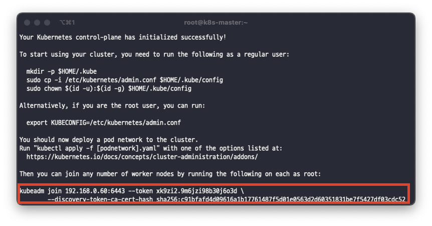
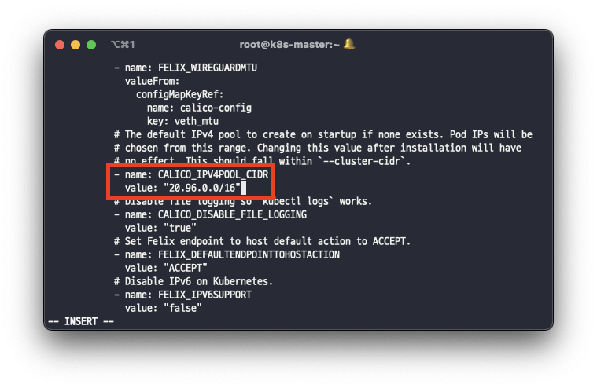
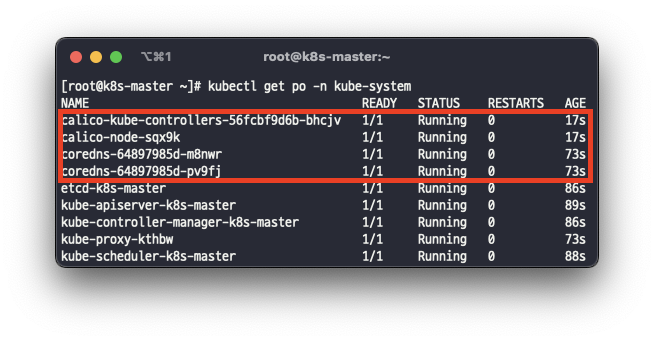

On-Premise환경에서 쿠버네티스 클러스터를 구성하면서 정리한 글입니다.

## Cluster 환경으로 구성하기



XCP-ng(Xen) Hypervisor위에 총 4대(마스터 1대, 워커 3대)의 인스턴스를 만들어 Cent OS 7을 설치해 쿠버네티스 클러스터를 구성하려고합니다. 각각의 성능은 아래와 같이 설정했습니다.

```
OS : Cent OS 7
Master 1대 / RAM 16GB / Storage 200GB
Worker 3대 / RAM 8GB  / Storage 200GB
```

## 마스터, 워커 노드 공통 작업

### hostname 설정

마스터, 워커 노드의 호스트 네임을 각각 지정합니다.

```bash
hostnamectl set-hostname k8s-master
hostnamectl set-hostname k8s-worker1
hostnamectl set-hostname k8s-worker2
hostnamectl set-hostname k8s-worker3
```

hostname이 정상적으로 수정되었는지 확인합니다.

```bash
hostname
```



/etc/hosts 파일을 수정해 위에서 등록한 호스트 네임과 각각의 마스터, 워커 서버의 ip를 등록합니다.

```bash
cat << EOF >> /etc/hosts
192.168.0.60 k8s-master
192.168.0.65 k8s-worker1
192.168.0.66 k8s-worker2
192.168.0.67 k8s-worker3
EOF
```

/etc/hosts에 정상적으로 마스터, 워커 노드의 호스트 네임과 ip가 등록되었는지 확인합니다.

```bash
cat /etc/hosts
```



### 메모리 Swap 끄기

Kubernetes에서는 메모리 Swap을 사용하지않기 때문에 종료합니다.

> [why k8s disable swap](https://www.evernote.com/shard/s360/client/snv?noteGuid=caa3d18e-4bda-4516-9ec9-1180999015e2&noteKey=46fa507ba5b78edc&sn=https%3A%2F%2Fwww.evernote.com%2Fshard%2Fs360%2Fsh%2Fcaa3d18e-4bda-4516-9ec9-1180999015e2%2F46fa507ba5b78edc&title=191120%2Bwhy%2Bk8s%2Bdisable%2Bswap%253F)  
> [Kubelet/Kubernetes should work with Swap Enabled](https://github.com/kubernetes/kubernetes/issues/53533)

```bash
swapoff -a
sed -i '/ swap / s/^\(.*\)$/#\1/g' /etc/fstab
```

### Selinux mode 변경

Sellinux mode를 Permmisive로 변경합니다.

```bash
setenforce 0
sed -i 's/^SELINUX=enforcing$/SELINUX=permissive/' /etc/selinux/config
```

### iptables 설정

iptables가 브릿지 네트워크를 관리할 수 있도록 설정합니다.

```bash
modprobe br_netfilter

cat <<EOF | sudo tee /etc/modules-load.d/k8s.conf
br_netfilter
EOF
```

```bash
cat <<EOF >  /etc/sysctl.d/k8s.conf
net.bridge.bridge-nf-call-ip6tables = 1
net.bridge.bridge-nf-call-iptables = 1
EOF
```

sysctl --system 명령어를 통해 정상적으로 값이 설정되어 있는지 확인합니다.

```bash
sysctl --system
```



### Docker 설치

쿠버네티스를 관리하는 컨테이너를 설치하기위해 도커를 설치합니다.

```bash
yum install docker -y && systemctl enable --now docker
```

### kubelet, kubeadm, kubectl 설치

쿠버네티스를 내려받을 저장소를 등록합니다.

```bash
cat <<EOF | sudo tee /etc/yum.repos.d/kubernetes.repo
[kubernetes]
name=Kubernetes
baseurl=https://packages.cloud.google.com/yum/repos/kubernetes-el7-\$basearch
enabled=1
gpgcheck=0
repo_gpgcheck=0
gpgkey=https://packages.cloud.google.com/yum/doc/yum-key.gpg https://packages.cloud.google.com/yum/doc/rpm-package-key.gpg
exclude=kubelet kubeadm kubectl
EOF
```

쿠버네티스를 구성하기 위해 kubelet, kubeadm, kubectl를 설치하고, kublet을 실행시킵니다.
> 여기서는 버전을 지정하지않고 최신 버전으로 설치했습니다.

```bash
yum install -y kubelet kubeadm kubectl --disableexcludes=kubernetes
```

```bash
systemctl enable --now kubelet
```

## 마스터 노드 작업
### kubeadm init

쿠버네티스가 컨테이너에 부여하는 네트워크를 설정해 클러스터를 초기화합니다.
> 각 서버의 네트워크 대역과 중복되지 않게 설정해야 합니다. 여기서는 20.96.0.0/12로 설정했습니다.

```bash
kubeadm init --pod-network-cidr=20.96.0.0/12
```

kubeadm init후 하단에 출력되는 kubeadm join으로 시작하는 명령어를 복사합니다. 추후 워커 노드에서 마스터 노드로 접속하는데 사용됩니다.



마스터 노드에서 쿠버네티스를 정상적으로 구동할 수 있게 설정 파일을 복사하고, 사용자에게 권한을 부여합니다.

```bash
mkdir -p $HOME/.kube
sudo cp -i /etc/kubernetes/admin.conf $HOME/.kube/config
sudo chown $(id -u):$(id -g) $HOME/.kube/config
```

### Kubernetes CNI(Calico) 적용

쿠버네티스 컨테이너 사이의 통신을 위해 Calico를 설치합니다.
> CNI는 Flannel, weaveNet, Calico 등이 있습니다. 여기서는 Calico로 설치를 진행합니다.

```bash
curl https://projectcalico.docs.tigera.io/manifests/calico.yaml -o calico.yaml
```

calico.yaml에 설정되어 있는 기본 IP 대역은 192.168.0.0/16으로 설정되어있기 때문에 이를 변경해줘야 합니다.

주석처리된 부분을 해제하고 클러스터 초기화때 설정한 IP 대역으로 변경합니다.

```bash
vi calico.yaml
```



```bash
kubectl apply -f calico.yaml
```

아래의 명령어를 통해 Calico가 정상적으로 실행되고 있는지 확인합니다.

```bash
kubectl get po -n kube-system
```



### firewalld 설정 

> 마스터, 워커 노드 공통적으로 설정해야합니다.

Calico에서 firewalld또는 다른 iptables 관리자가 설치되어있는 경우 비활성화해야 합니다. 

> If your Linux distribution comes with installed Firewalld or another iptables manager it should be disabled. These may interfere with rules added by Calico and result in unexpected behavior. ([System requirements](https://projectcalico.docs.tigera.io/getting-started/kubernetes/requirements))

```bash
systemctl stop firewalld && systemctl disable firewalld
```

### NetworkManager 설정

> 마스터, 워커 노드 공통적으로 설정해야합니다.

NetworkManager가 Calico 인터페이스를 제어하지 못하도록 아래와 같이 설정합니다.

> Calico must be able to manage cali* interfaces on the host. When IPIP is enabled (the default), Calico also needs to be able to manage tunl* interfaces. When VXLAN is enabled, Calico also needs to be able to manage the vxlan.calico interface. ([System requirements](https://projectcalico.docs.tigera.io/getting-started/kubernetes/requirements))

```bash
vi /etc/NetworkManager/conf.d/calico.conf
```

```bash
[keyfile]
unmanaged-devices=interface-name:cali*;interface-name:tunl*;interface-name:vxlan.calico;interface-name:wireguard.cali
```

```bash
systemctl restart NetworkManager
```

## 워커 노드 작업
### kubeadm join

이전 kubeadm init 수행 후 출력된 명령어를 워커 노드에 실행합니다.

```bash
kubeadm join 192.168.0.60:6443 --token e7vsa9.mxaugeztlr1xkbgy \
        --discovery-token-ca-cert-hash sha256:891df1bc5c713a5853fffb991f883cf6ce2e931172c2235f8fe1ee8cdc3fb203
```

## Kubernetes Cluster 확인

아래의 명령어를 통해 쿠버네티스에 등록된 모든 노드를 확인할 수 있습니다. 처음 계획했던대로 마스터 노드 1개, 워커 노드 3개가 등록되어 있다면 정상입니다.

```bash
kubectl get nodes
```


## 참고
* [kubeadm으로 클러스터 구성하기 공식 문서](https://kubernetes.io/ko/docs/setup/production-environment/tools/kubeadm/_print/)
* [Calico System requirements](https://projectcalico.docs.tigera.io/getting-started/kubernetes/requirements)
* [Install Calico networking and network policy for on-premises deployments](https://projectcalico.docs.tigera.io/getting-started/kubernetes/self-managed-onprem/onpremises)
* [Calico Troubleshooting and diagnostics](https://projectcalico.docs.tigera.io/maintenance/troubleshoot/troubleshooting#configure-networkmanager)