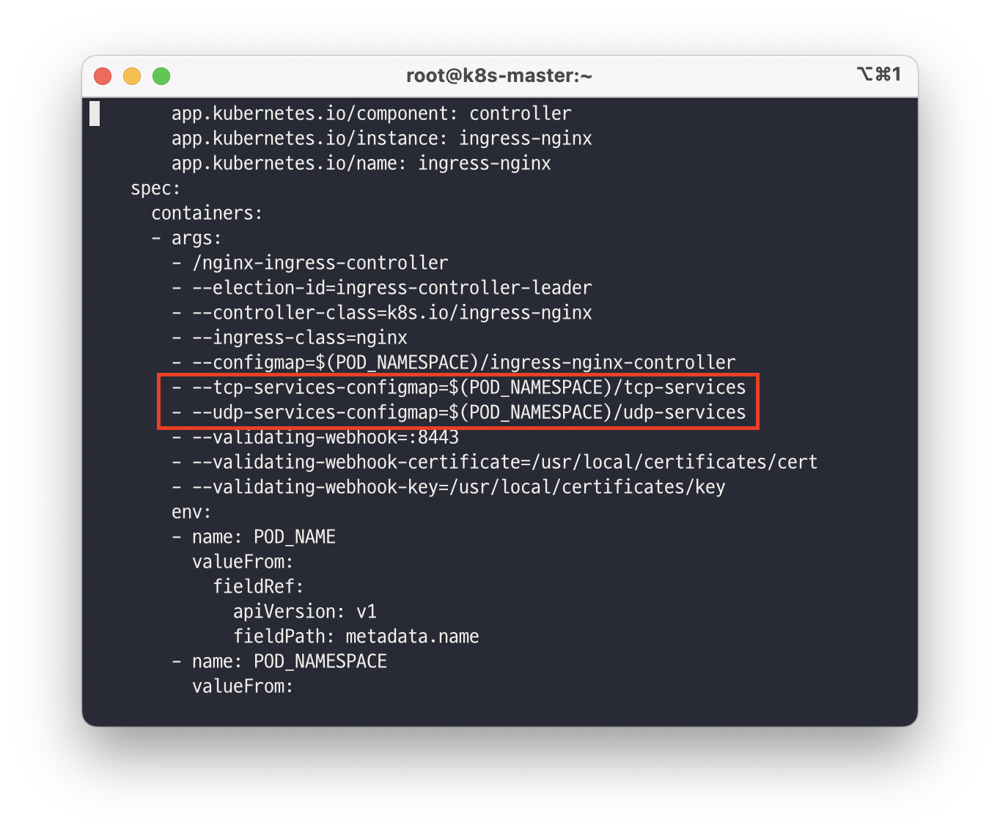
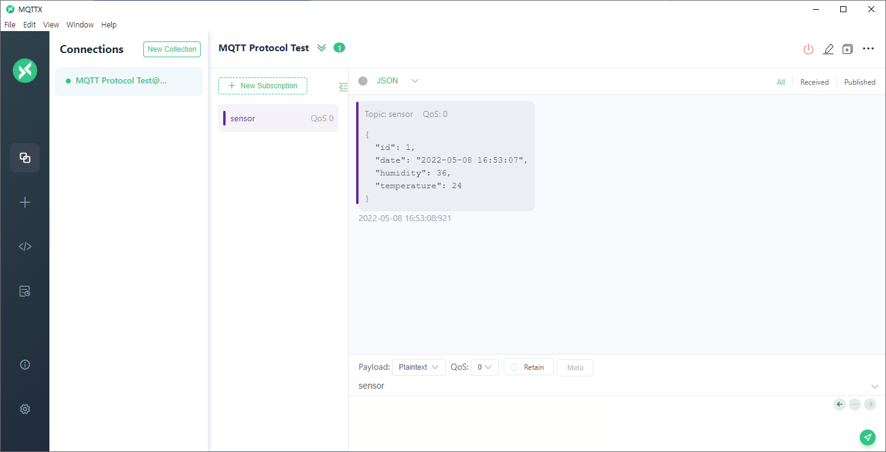

RabbitMQ의 MQTT 프로토콜 포트(1883)를 Ingress에서 접속할 수 있게 작업한 삽질기 입니다.

### 시작

RabbitMQ를 MQTT Broker로 사용할 일이 있어 k8s에 설치를하고 Nginx-Ingress를 이용해 RabbitMQ 관리콘솔과 domain을 연결했습니다. 하지만 **MQTT Protocol**은 **1883** 포트를 이용해 통신하기 때문에 Ingress에 TCP port를 노출시킬 방법을 찾아보고 정리했습니다.

### Nginx-Ingress 공식 문서

> [Nginx Document: exposing tcp udp services](https://kubernetes.github.io/ingress-nginx/user-guide/exposing-tcp-udp-services/)
> 

Nginx-Ingress의 공식 문서에서는 tcp-services와 udp-services라는 ConfigMap을 통해 TCP Port를 노출할 수 있다고 합니다.

### Bare Metal의 경우

현재 On-premise 환경이기 때문에 Nginx-ingress를 Bare Metal 버전으로 설치했습니다. Bare Metal 버전은 tcp-services와 udp-services가 설정되어있지 않기 때문에 Nginx-Ingress의 Deployment에 아래의 두 줄을 추가해 ConfigMap을 참조할 수 있도록 합니다.

```bash
kubectl edit deployment.apps/ingress-nginx-controller -n ingress-nginx
```

```bash
- --tcp-services-configmap=$(POD_NAMESPACE)/tcp-services
- --udp-services-configmap=$(POD_NAMESPACE)/udp-services
```



### tcp-service ConfigMap 수정

현재 MQTT사용을 위해 RabbitMQ의 1883 포트를 개방해야 하기때문에 아래와 같이 설정했습니다. **\<expose port\>: \<namespace/service name\>:\<service port\>**의 형태로 설정하면 됩니다.

```bash
apiVersion: v1
kind: ConfigMap
metadata:
  name: tcp-services
  namespace: ingress-nginx
data:
  1883: "rabbitmq-system/rabbitmq-cluster:1883"
```

```bash
kubectl apply -f tcp-services.yaml
```

### MQTT Client에서 테스트

이제 ingress domain:1883으로 연결을 해보면 정상적으로 접속이 되어 외부 센서에서 값이 들어오고 있는것을 확인할 수 있습니다.



### 참고

- **[Exposing TCP and UDP services](https://kubernetes.github.io/ingress-nginx/user-guide/exposing-tcp-udp-services/)**
- **[TCP Port Forwarding with Nginx Ingress on a Bare Metal Kubernetes Cluster](https://karthick.it/posts/2021/02/tcp-port-forwarding-with-nginx-ingress-on-a-bare-metal-kubernetes-cluster/)**