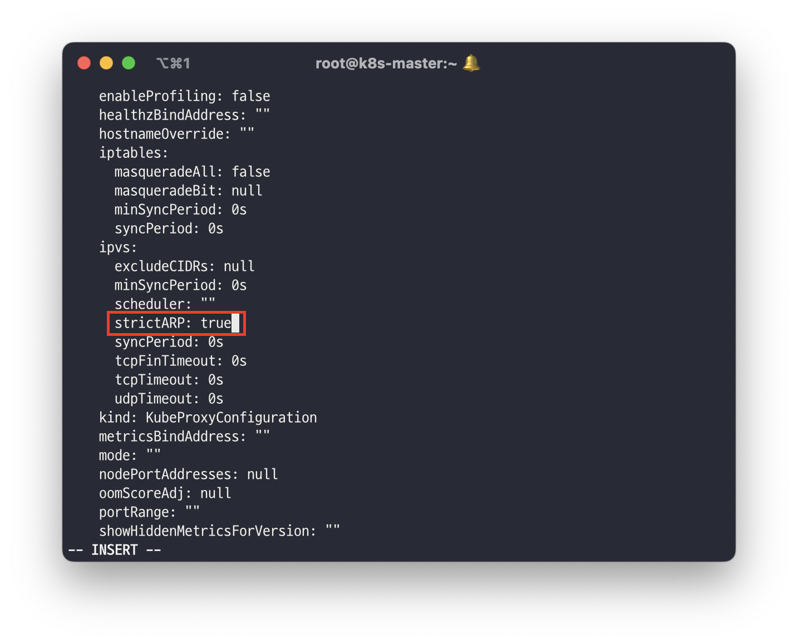
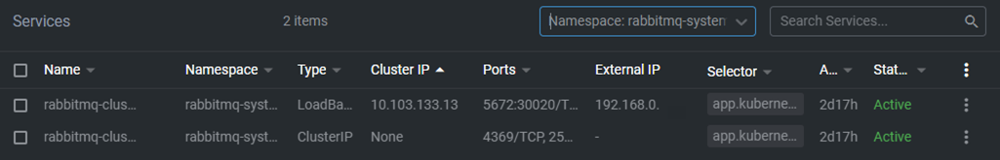

On-Premise환경에서 LoadBalancer를 사용하기위해 MetalLB를 설치해보려고 합니다. 설정 방법은 metallb의 공식 문서를 참고하였고 L2 네트워크로 로드밸런서를 구성했습니다.

> [https://metallb.universe.tf/installation/](https://metallb.universe.tf/installation/)
> 

### StaticARP 설정

kube-proxy를 사용하는 경우 Kubernetes v1.14.2부터 strictARP를 활성화해야한다고 나와있습니다. 아래의 명령어를 사용해 configmap를 수정합니다.

```bash
kubectl edit configmap -n kube-system kube-proxy
```



### MetalLB 설치

아래의 명령어를 통해 metallb namespace와 components를 설치합니다.

```java
kubectl apply -f https://raw.githubusercontent.com/metallb/metallb/v0.12.1/manifests/namespace.yaml
kubectl apply -f https://raw.githubusercontent.com/metallb/metallb/v0.12.1/manifests/metallb.yaml
```

정상적으로 설치되었다면 metallb-system에 controller와 speaker pod이 배포된 것을 확인할 수 있습니다.

```bash
kubectl get po -n metallb-system
```

```bash
[root@k8s-master ~]# kubectl get po -n metallb-system
NAME                         READY   STATUS    RESTARTS       AGE
controller-57fd9c5bb-8xzr5   1/1     Running   12 (34h ago)   41d
speaker-6vj7t                1/1     Running   9 (34h ago)    41d
speaker-7zrsw                1/1     Running   7              41d
speaker-dp2qr                1/1     Running   8 (34h ago)    41d
speaker-jm4cz                1/1     Running   7 (34h ago)    41d
```

### MetalLB 설정

Metallb 설정을 위해 metallb-config.yaml 파일을 생성하고 아래와 같이 ConfigMap을 구성합니다.

```bash
vi metallb-config.yaml
```

```bash
apiVersion: v1
kind: ConfigMap
metadata:
  namespace: metallb-system
  name: config
data:
  config: |
    address-pools:
    - name: default
      protocol: layer2
      addresses:
      - 192.168.0.70-192.168.0.99
```

```bash
kubectl apply -f metallb-config.yaml
```

### External IP 확인

Loadbalancer 설정 이전에는 External IP가 \<Pending\> 상태였지만 metallb 설정 이후 정상적으로 External IP가 부여된 것을 확인할 수 있습니다.

