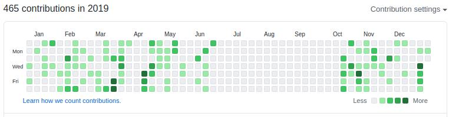
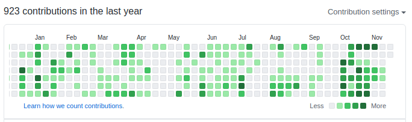
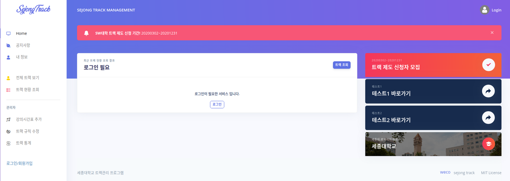
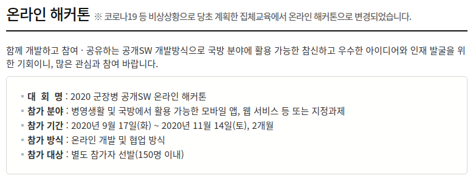

2020년도 군대에서 나름 년 동안이라는 시간 동안 공부하는 동안 배웠던 것들을 정리할 겸 올려본다.

## 사지방에서 코딩...?

19년 10월 15일쯤부터 회고를 작성하고 있는 20년 11월 16일 거의 1년 정도를 사지방에서 코딩을 했는데 사지방에서 코딩을 하기 위해 온갖 클라우드 IDE를 사용해봤다 ㅋㅋㅋ

처음에는 Goorm IDE를 하다가 자동완성과 자동 임포트 기능을 지원하지 않는 게 너무 불편해서.... 이것저것 테스트해보다가 결국에는 VS Code의 웹 버전인 Code-Server를 올려서 웹으로 작업을 했다. 그래도 로컬에서 작업하는 것에 비해 진짜 너무 불편해서 로컬에 IDE 설치해서 하던 때를 감사하게 된다....

~전역만 시켜주시면 열심히 할게요 ㅠㅠ~

## 트랙관리 프로그램

내 첫 프로젝트이자 아무것도 모르던 시절에 시작한 프로젝트를 이제야 마무리했다.

~~3년이나 잡고 있었다는 것은 안 비밀....~~

이제는 애증의 프로젝트가 되어 버렸다... 이대로 내버려 두기에는 뭔가 아쉽고 더 하기에는 레거시한 코드를 갈아엎을 용기가 없어서....

학교 동기들과 같이 개발한 프로젝트인데 나중에 Agile 개발 방법론 책을 읽다가 책에서 이야기하는 고전적인 수직적 구조의 프로젝트에서의 특징이라고 하는 것들을 모두 내가 프로젝트에 했다는 것을 보고 반성했다... 그것도 그렇고 레거시한 프로젝트를 잡고 있다가 어떻게 흥미를 잃고 망해가는지 몸소 느끼기도 했고... 테스트 코드 없이 개발했다가 나중에 리펙터링후에도 제대로 동작하는지 몰라 테스트 코드의 중요함을 느끼고... 이런 프로젝트에 학교 동기들을 끌어들인 것에 대해 미안함을 느낀다 ㅋㅋ...

그래도 정말 많은 것을 배운 프로젝트인 것 같다. 처음으로 배포해보기도 했고, 깃허브로 협업하면서 협업방식에 대해 배우고, 스프링 부트에 조금 더 친해진 것 같다.

### 느낀 점

-   테스트 코드 작성하자... 무조건...
-   레거시한 프로젝트를 뜯어고치는 것보다 새로 개발하는 게 더 빠르다
-   무작정 만들지 말고 설계부터 하자 ㅋㅋ
-   고전적 개발 방식 -> Agile 개발 방식을 도입 하자
-   유지보수를 생각하고 코딩하자....!

## 군장병 공개 SW 해커톤

처음 자대에 왔을 때 군대 인트라넷에서 군장병을 대상으로 대회가 있다는 것을 알게 되었고 그때는 일병 2호봉이어서 군생활이나 열심히 하자는 생각으로 내년을 기약했었다.

그리고 올해 온라인 교육을 듣고 코딩 테스트를 보아 온라인 교육 우수자에 선발되어 군장병 공개 SW 해커톤에 참가하여 1달 동안 타부대 팀원들과 멘토분의 멘토링을 받으면서 비대면 스마트폰 반납 시스템을 제작했었다.

이 대회를 진행하면서 느낀 점은.... 정말 여러 분야의 사람들을 만나야겠다는 생각이 들었다. 다른 분야의 사람들과 이야기를 하다 보면 좁아진 내 시야를 넓혀주는 느낌이다...! 진짜 이번 대회를 진행하면서 팀원들에게도 정말 많은 것을 배웠고, 멘토분들의 조언 하나하나가 값진 조언이었다고 생각한다... 그리고 국방부장관상을 수상한 것도 정말 큰 전역 선물을 받은것 같아 군생활을 돌아봤을 때 가장 보람찬 일중 하나인 것 같다.