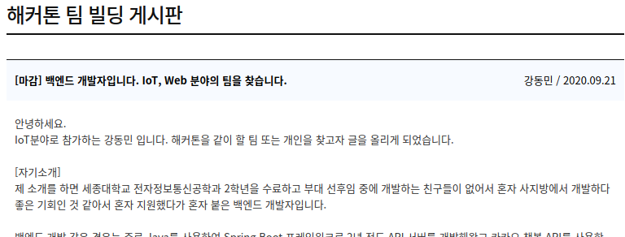
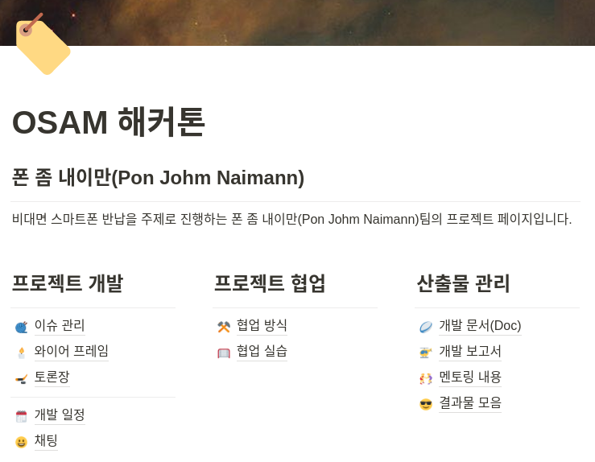

## 나만 팀 없어...

팀빌딩은 처음부터 같은 부대 인원들과 같이 신청했으면 같이 하면 되는데 필자 같은 경우는 부대에서 혼자 신청했기때문에 팀 빌딩 게시판에서 팀을 구하는 글을 올렸다 ㅠㅠ

살짝 ㅎㅎ.. 전체를 올리긴 그래서 일부분만 올린다.

## 폰 좀 내이만 팀

몇몇 팀에서 연락이 왔고 그중에서 휴대폰 비대면 반납 시스템을 주제로 하는 팀에게 연락이 왔고 팀장분이 휴가를 나가서 실물을 제작할수 있다는 점이 매력적이여서 Web 파트를 담당할 필자와 IoT 파트를 담당하는 팀장님 App 파트를 담당하는 팀원 이렇게 3명이서 프로젝트를 진행하게 되었다! 

## 사지방에서 협업하기

협업 같은 경우는 사지방에서 작업해야 하기때문에 Notion에서 의논하기로 했다. 예전에 학교 동기가 프로젝트할때 사용하면 좋다는 걸 듣고 눈여겨 보고 있었는데 이번 해커톤이 온라인인 만큼 실시간 소통과 문서화에 편할것 같아 도입하였다.

개발은 연등(22-24)때와 주말에는 하루종일 사지방에서 개발을 했다 ㅋㅋ... 사지방이라 개발환경이 매번 초기화되기도 하고 Source Tree 같은경우는 작동을 안해서;; git 명령어를 학습하느라 초기에 어려움이 있었다. 그래도 이번기회에 git 명령어를 배우면서 git에 대해서는 확실하게 공부 한것 같다.

## 멘토링

나에게 있어 군생활중 가장 유익한 활동이 아니였나 싶다.... IoT분과 멘토분께 멘토링 받으면서 정말 많은것을 배웠던것 같다. 

- 라이센스는 어떻게 정하는지 (AGPL, GPL, MIT, Apache 2.0, BSD 3 등등)
- [Readme.md](http://readme.md)작성은 어떻게 하는지
- [Readme.md](http://reame.md)를 하이브리드 하게 작성하기
- 프로젝트 문서화는 어떻게 하는지
- 프로젝트 구성은 어떻게 해야 하는지
- CC BY-SA가 무엇인지

여기서 전부 나열하지는 못하지만 진짜 많은것을 배웠고 특히 라이센스 관련되서 정말 많은 도움과 가르침을 받았다.

## 팀플

처음에는 사실 원격으로 팀플을 제대로 할수 있을까? 그것도 처음보는 팀원들하고? 라는 생각이 컸다. 하지만 해커톤 시작전에 Git Workflow를 위해 이것저것 맞추고 협업을 해보았는데 다들 사지방의 열악한 환경에서 개발을 갈망하던 개발자(~~사실은 전부 말년 병장...~~)들이여서 다들 적극적으로 참여하고 협업해서 너무나도 즐겁게 개발했다.

또한 다른 분야의 팀원들과 개발에 대해 의논하고 기획하면서 여러분야에 대한 견문을 넓힐수 있었던것 같다. 특히 팀장님이 수학적으로 암호화 알고리즘을 설계는걸 보면서 신선한 충격을 받았다. 사실 프로그래머에게 수학이 필요하나 싶었는데 ㅋㅋ.... 공부해야겠다. 그래도 그동안 프로젝트를 하면서 이것저것 도입(Github Actions CI/CD, Git Workflow, 컨벤션 등등...)하면서 여러가지 시행착오를 겪으면서 많은것을 해보고 배웠는데 팀원분들이 잘 따라준 덕분에 이번 팀플에서 제대로 사용했고 그 덕을 많이 봤다.

## 마지막으로...

사실 개발자를 희망하는 학생들에게 군생활 1년 6개월이란 시간은 아무것도 안하기에는 너무나도 긴 시간인것 같다 ㅠㅠ 그래서 틈틈히 연등때 사지방에서 개발을 해왔지만 이번 활동을 통해 너무나 값진 경험과 좋은 팀원들을 만난것 같아 누군가 나에게 군생활중 가장 보람찼던 일이 무었이냐고 물어보면 이번 활동이라고 자신있게 말할수 있을것 같다.

## 혹시 궁금하다면

[osamhack2020/WEB_KookMoBan_PonJohmNaimann](https://github.com/osamhack2020/WEB_KookMoBan_PonJohmNaimann)