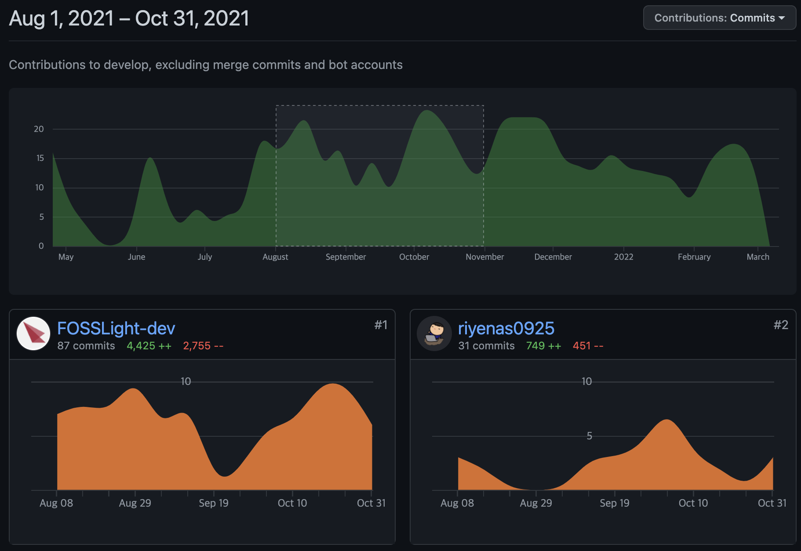
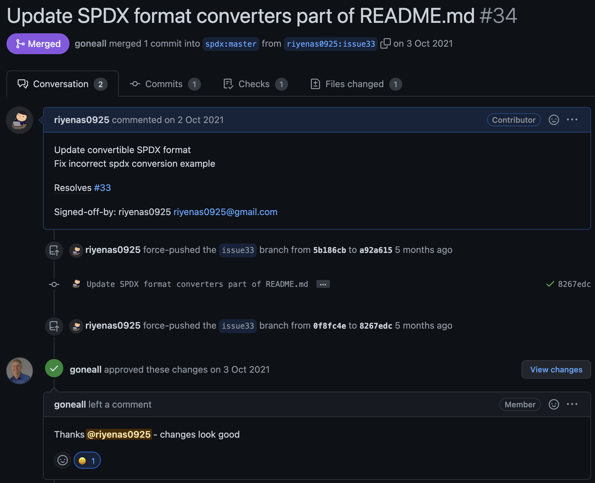
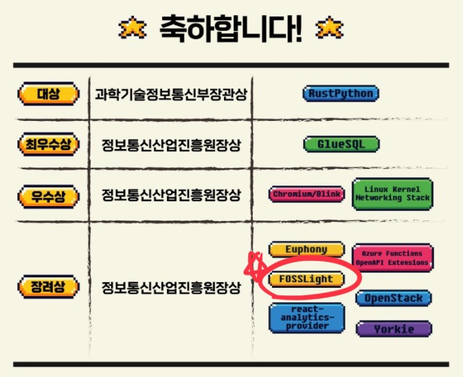

2개월 동안 진행한 오픈소스 컨트리뷰션 아카데미 회고를 작성해보려고 합니다.

## 오픈소스 컨트리뷰션 아카데미
종강이 얼마 남지 않기도 했고 멘토님의 가이드를 받으며 오픈소스 컨트리뷰션의 한 사이클을 경험해볼 수 있다는 점이 마음에 들어 지원서를 바로 제출했습니다.

## 오픈소스 Deep Dive

### Git 제대로 배우기
오픈소스 컨트리뷰션 아카데미의 첫 활동은 컨트리뷰션을 위한 Git강의였습니다.

대부분의 오픈소스가 GitHub위에 올라가있기도 하고 컨트리뷰션을 fork한 Origin 저장소에서 진행하고 Upstream 저장소에 Pull request를 보내는 방식으로 진행되기 때문에 Git과 관련된 다양한 기능들을 배웠습니다. 

아래처럼 이론뿐만 아니라 **실제 사례를 통해 깃허브를 다루는 법**을 배우면서 컨트리뷰션에 필요한 기초를 배웠습니다.

* 중간에 있는 커밋을 하나로 합치기
* Origin의 브랜치에서 rebase를 통해 Upstream의 main브랜치의 최신 코드 반영하기
* blame을 통해 어떤 개발자가 수정했는지 확인하기
* merge conflict 수정하기
* PR을 보내는 방법과, Signed-off를 작성하는 이유
* 오픈소스를 컨트리뷰션 방법과 매너

### good first issue

본격적인 컨트리뷰션에 앞서 처음에는 큰 규모의 작업보다는 전체 컨트리뷰션 사이클을 체험해보기 위해 비교적 간단한 이슈인 good first issue를 찾아서 작업을 진행했습니다.

이슈를 해결하기 전에 생각한 해결방식을 정리해 이슈의 코멘트로 메인테이너의 의견을 물어보았고 다행히도 메인테이너분도 제가 제시한 수정방안에 동의해 주셔서 Pull Request를 보냈습니다.

메인테이너의 리뷰를 받고 살짝 수정할 부분이 있어 수정을 한 다음 approve를 받아 머지를 받았습니다.

이후에는 이슈를 찾고 해결 방안에 대한 생각을 메인테이너와 상의해 컨트리뷰션을 진행하고 리뷰를 받아 머지하는 컨트리뷰션 사이클을 반복하면서 활동을 진행했습니다.

## 무엇을 배우고 느꼈을까?

### Git 자유자제로 다루기
Git을 내 맘대로 다룰 수 있게 되어서 정말 좋았습니다. 

개발을 하다보면 수많은 Git과 관련된 오류를 만났습니다... 이럴 때마다 브랜치를 다시 체크아웃한다든지 저장소를 새로 포크 뜬다든지 하는 방식으로 어찌어찌 해결했지만 지금 생각해보면 매번 새로 포크를 뜨거나 체크아웃하기에는 너무 번거롭고 귀찮은 작업이었습니다. 하지만 컨트리뷰션을 진행하면서 다양한 상황을 만나고 문제 해결을 하면서 Git을 다루는 능력을 확실하게 키울 수 있는 능력을 키울 수 있었습니다.

### 오픈소스 사용자에서 컨트리뷰터까지
지금까지는 단순히 오픈소스를 찾아 사용하다 이슈를 발견하면 언젠간 메인테이너가 고쳐주겠지?, 다른 오픈소스를 찾아봐야 하나? 라는 생각을 가졌습니다. 

학생인 내가 오픈소스에 직접 기여를 한다는 생각 자체를 못하기도 했고 어떻게 오픈소스에 기여해야 하는지 방식을 모르기도 했습니다. 하지만 이슈 -> PR -> 리뷰 -> 머지로 이루어지는 컨트리뷰션 사이클을 경험해보면서 간단한 오타수정부터 버그 픽스, 기능 추가, 새로운 기능 제안 등 오픈소스 프로젝트에 도움이 될 수 있다면 모든것이 컨트리뷰션이라는 걸 느꼈고 간단한 이슈라도 적극적으로 컨트리뷰션을 진행하게 되었습니다.

이전에는 오픈소스를 사용하다 발견한 오류를 그냥 무시하고 언젠간... 고쳐주겠지? 라며 지나쳤다면 이제는 한번쯤은 등록된 이슈가 있는지 확인해보고 없다면 등록할 정도의 여유가 생겼습니다. 아래는 제가 참여했던 FOSSLight 프로젝트 이외에 따로 개발을 하면서 이슈를 발견해 PR을 보낸 spax-java-tools 라이브러리 저장소입니다!

처음에는 컨트리뷰션은 학생이 하기에는 진입장벽이 높고 어렵다고 생각했는데 막상 직접 해보니 **누구나 쉽게 할 수 있고 누구에게나 열려있다**는 것을 알게 된 것 같습니다.

## 마지막으로
장려상을 받았습니다! 

25팀 중 10팀 안에 들어 상을 받은 것도 기쁘지만, 2개월 동안 오로지 오픈소스 컨트리뷰션 하나에 몰입하고 멘토님들의 가이드를 받으며 오픈소스 컨트리뷰션을 진행해 볼 수 있다는 점이 정말 좋았습니다.

그리고 운이 좋게 리드 멘티를 맡아 FOSSLight팀이 어떻게 컨트리뷰션을 즐기며 활동했는지에 대해 발표를 했습니다. 평소 이렇게 많은 사람들 앞에서 발표할 기회가 없는데 이번 기회에 발표를 준비하고 할 수 있어서 좋았습니다.

<iframe width="560" height="315" src="https://www.youtube.com/embed/_eH-KqwmHck" title="YouTube video player" frameborder="0" allow="accelerometer; autoplay; clipboard-write; encrypted-media; gyroscope; picture-in-picture" allowfullscreen></iframe>

> 여담으로 부제를 정말 많이 고민했는데 다른 멘티분이 **오픈소스를 관리하는 오픈소스** 라는 부제를 추천해주셨고 FOSSLight에 정말 맞는 부제인 것 같아 그대로 사용했습니다.

**만약 나도 할 수 있을까? 라고 지원하기를 망설이고 있다면 주저하지 말고 신청하라고 추천하고싶은 활동입니다.**

> FOSSLight팀의 김경애 멘토님, 김소임 멘토님 그리고 같이 컨트리뷰션을 진행한 17명의 멘티님 감사합니다!