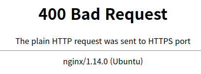

## HTTPS로 전환할 때 필요한 것들

- 개인키(.key)
- 인증서파일(.crt)
- 서면요청파일(.csr)

> 서면요청파일은 SSL 서버를 운영하는 회사의 정보를 암호화하여 인증기관으로 보내 인증서를 받게 하는 일종의 신청서
> 

원래라면 CA에서 돈을주고 발급해야하지만 OpenSSL를 통해 자체적으로 발급받을수 있다.

```bash
$ sudo apt-get install openssl
```

## OpenSSL 인증서 발급받기

```bash
openssl req -new -newkey rsa:2048 -nodes -keyout 도메인이름.key -out 도메인이름.csr
```

아래 질문에 맞게 정보를 입력하면 됩니다.

```bash
You are about to be asked to enter information that will be incorporated
into your certificate request.
What you are about to enter is what is called a Distinguished Name or a DN.
There are quite a few fields but you can leave some blank
For some fields there will be a default value,
If you enter '.', the field will be left blank.
-----
Country Name (2 letter code) [AU]:KR
State or Province Name (full name) [Some-State]:Incheon
Locality Name (eg, city) []:Bupyeong
Organization Name (eg, company) [Internet Widgits Pty Ltd]:Riyenas 
Organizational Unit Name (eg, section) []:Riyenas
Common Name (e.g. server FQDN or YOUR name) []:Riyenas
Email Address []:riyenas0925@gmail.com

Please enter the following 'extra' attributes
to be sent with your certificate request
A challenge password []:
An optional company name []:
```

그다음 아래 명령어로 crt 파일을 생성합니다.

```bash
openssl x509 -req -days 365 -in 도메인이름.csr -signkey 도메인이름.key -out 도메인이름.crt
```

nginx에 ssl을 적용하기위해 아래의 경로에 있는 default 파일을 편집해봅시다.

```bash
sudo vi /etc/nginx/sites-available/default
```

아래의 4줄을 server 안에 넣어주고

```bash
listen 443;
ssl on;
ssl_certificate         /home/riyenas0925/riyenas.crt;
ssl_certificate_key     /home/riyenas0925/riyenas.key;
server_name study.riyenas.dev;
```

nginx를 재부팅 해주면 끝!

```bash
sudo /etc/init.d/nginx restart
```

만약 아래와 같은 오류가 발생하면 nginx default 파일에 아래 명령어를 추가하면됩니다.



```bash
error_page 497 https://$server_name$request_uri;
```