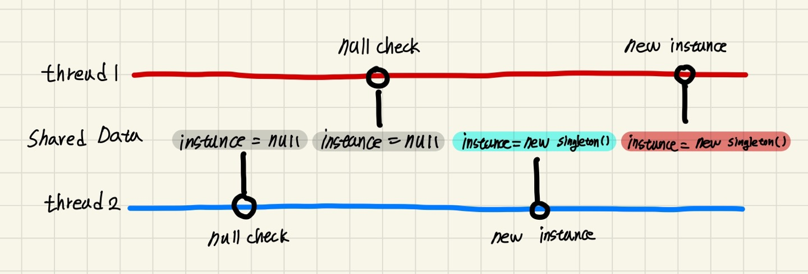

## 싱글턴 패턴
싱글턴 패턴은 단 하나의 인스턴스만 제공하는 클래스입니다. 
시스템 런타임, 환경 세팅과 같이 시스템상에서 유일해야 하는 경우에 사용합니다.


## 싱글 스레드의 싱글턴 패턴
private 생성자와 static 메서드를 이용해 만든 방식입니다. getInstance() 메서드를 호출했을 때 인스턴스가 null이라면 생성하고 null이 아니라면 기존에 생성된 인스턴스를 반환하도록 구현되어 있습니다.

```java
public class Singleton {
    private static Singleton instance;

    private Singleton() {

    }

    public static Singleton getInstance() {
        if (instance == null) {
            instance = new Singleton();
        }
        return instance;
    }
}
```

하지만 이 방법은 싱글스레드에서는 문제가 없지만 **멀티스레드에서 문제가 발생** 할 수 있습니다.

아직 **인스턴스가 초기화되지 않은 상태**에서 **스레드 1과 스레드 2가 동시에 getInstance() 메서드를 호출**했다면 아래와 같은 문제가 발생할 수 있습니다.

먼저 스레드 2가 null 체크 후 인스턴스를 생성하기 이전에 스레드 1이 null 체크를 한다면 아직 인스턴스가 null이기 때문에 스레드 1 또한 null 체크를 통과하게 됩니다. 따라서 스레드 1, 2 모두 null 체크를 통과해 **각각 새로운 인스턴스를 반환**하게 됩니다.



**따라서 위의 방식은 멀티스레드 환경에서는 안전하지 않습니다.**


## 멀티 스레드의 싱글턴 패턴

### 동기화(Synchronized)를 사용한 방식
**synchronized 키워드**를 getInstance() 메서드에 붙여 한번에 하나의 스레드만 들어올 수 있게해 동시에 여러 스레드가 들어올 수 없게해 단 **하나의 인스턴스만 보장**합니다. 

하지만 getInstance() 메서드가 호출될 때마다 **동기화 처리 작업**을 하기 때문에 **성능 저하가 발생**합니다.

```java
public class Singleton {
    private static Singleton instance;

    private Singleton() {

    }

    // 동기화(Synchronized) 사용
    public static synchronized Singleton getInstance() { 
        if (instance == null) {
            instance = new Singleton();
        }
        return instance;
    }
}
```

### 이른 초기화(eager initialization)을 사용한 방식
인스턴스를 **이른 초기화(eager initialization)**하는 방식입니다. 클래스가 로딩되는 시점에 static 필드가 초기화 되기 때문에 **멀티 스레드 환경에서도 안전**합니다.

하지만 이른 초기화를 하기 때문에 객체 생성 비용이 크거나 사용하지 않는다면 객체의 **사용 유무에 상관 없이 항상 싱글톤 객체가 생성**되고, **메모리를 잡고있기 때문에 비효율적**일 수 있다.

```java
public class Singleton {
    // 이른 초기화(eager initialization) 사용
    private static final Singleton INSTANCE = new Singleton();

    private Singleton() {

    }

    public static Singleton getInstance() {
        return INSTANCE;
    }
}
```

### double checked locking으로 효율적인 동기화 블럭 만들기


### static inner 클래스를 사용한 방식


## 싱글턴 패턴 깨트리기

### 리플렉션을 사용한 방법
위에서 구현한 방식은 **리플렉션을 이용해 싱글턴 패턴**을 깨뜨릴 수 있습니다.

리플렉션을 이용해 Singleton 클래스의 생성자를 접근가능하게 설정하고 newInstance() 메서드를 이용해 새로운 인스턴스를 반환하는것을 확인할 수 있습니다.

```java
@Test
@DisplayName("리플렉션을 사용하면 private 생성자를 호출할 수 있다.")
public void reflection() throws Exception {
    // given
    Singleton singleton = Singleton.getInstance();
    Singleton singletonReflection;

    // when
    Constructor<Singleton> constructor = Singleton.class.getDeclaredConstructor();
    constructor.setAccessible(true);
    singletonReflection = constructor.newInstance();

    // that
    assertThat(singleton).isNotSameAs(singletonReflection);
}
```

### 직렬화, 역직렬화를 사용한 방법

싱글턴 클래스가 Serializable 인터페이스를 구현했다면 **직렬화된 인스턴스를 역직렬화할 때마다 새로운 인스턴스가 생성**됩니다.

```java
public class Singleton implements Serializable {
    private static final Singleton INSTANCE = new Singleton();

    private Singleton() {

    }

    public static Singleton getInstance() {
        return INSTANCE;
    }
}
```

```java
@Test
@DisplayName("직렬화된 인스턴스를 역직렬화 할 때 인스턴스가 새롭게 생긴다.")
public void singleton() throws IOException, ClassNotFoundException {
    // given
    Singleton singleton = Singleton.getInstance();
    Singleton deserializeSingleton = null;

    // when
    try (ObjectOutput out = new ObjectOutputStream(new FileOutputStream("sigleton.obj"))) {
        out.writeObject(deserializeSingleton);
    }
    try (ObjectInput in = new ObjectInputStream(new FileInputStream("sigleton.obj"))) {
        deserializeSingleton = (Singleton) in.readObject();
    }

    // that
    assertThat(singleton).isNotSameAs(deserializeSingleton);
}
```

역직렬화 할때 새로운 인스턴스가 생기는 것을 방지하려면 역직렬화에 사용되는 **readResolve()를 구현해 기존의 인스턴스를 반환하도록 수정**해야 합니다.

```java
public class Singleton implements Serializable {
    private static final transient Singleton INSTANCE = new Singleton();

    private Singleton() {

    }
    
    // readResolve()에서 기존의 INSTANCE를 반환하게 한다.
    private Object readResolve() {
        return INSTANCE;
    }

    public static Singleton getInstance() {
        return INSTANCE;
    }
}
```

## enum을 이용한 방식

enum을 사용한 방식은 **리플렉션과 직렬화, 역직렬화**를 이용해 **새로운 인스턴스가 생기는 일을 완벽히 막아**줍니다. 하지만 Enum의 특성상 **상속이 불가**능하고 **클래스 로딩시 생성된다는 단점**이있습니다.

```java
public enum Singleton {
    INSTANCE;
}
```

## 싱글턴 패턴 사용 예시

## 참고
* [Java 언어로 배우는 디자인 패턴 입문](https://www.aladin.co.kr/shop/wproduct.aspx?ItemId=2104376)
* [코딩으로 학습하는 GoF의 디자인 패턴](https://www.inflearn.com/course/%EB%94%94%EC%9E%90%EC%9D%B8-%ED%8C%A8%ED%84%B4)
* [객체 지향과 디자인 패턴 ](https://www.aladin.co.kr/shop/wproduct.aspx?ItemId=28301535)