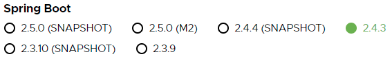
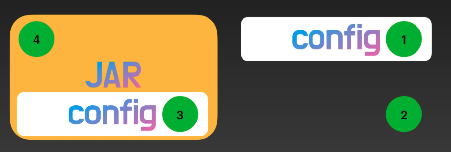

### 스프링 부트? 스프링? JEE?

- 스프링 부트 : 스프링을 쉽게 쓰기 위해 제공해주는 툴
- 스프링 : 자바 엔터프라이즈 개발을 편리하게 해주는 framework
- JEE : 자바 엔터프라이즈 에디션

# 빌드

## 프로젝트 생성

스프링에서 프로젝트 생성은 여러가지가 있다. (start.spring.io, intellij, eclipse 등등)

### SNAPSHOT, M2, 아무것도 안써있는 버전(GA)?

- SNAPSHOT : 개발중인 버전
- M2(Milestone) : 마일스톤으로 배포한 버전 (얼리 어댑터, 공부하는 사람이 아니면 권장 X)
- GA(General Availability) : 정식 배포 버전
- 정식 배포 버전을 사용하자!

### Project Metadata

프로젝트를 식별하는 정보

- group, artifact, version

### JAR, WAR

일단 모르면 JAR로 설정하고 나중에 WAR을 공부한다음 변경하는걸 추천

- JAR (Java Archive)
- WAR (Web Application Archive)

## 의존성 관리

프로젝트에 필요한 의존성을 쉽게 관리해주는 기능

### 특정 버전을 명시해주지 않았는데 어떻게 특정 버전의 라이브러를 불러오는가?

pom.xml에서는 상속 관계를 사용하여 상속을 받을수 있다.

pom.xml → spring-boot-starter-parent-2.4.3.xml → spring-boot-dependencies-2.4.3.xml

spring boot 버전에 맞는(최적화 되어 있는) 의존성의 버전을 미리 찾아 위에 파일들에 정의 해둠

따라서 버전을 몰라도 스프링 부트에서 버전을 관리해준다면 버전을 명시하지 않아도 사용할수 있다.

→ 스프링 부트가 관리를 해주는 라이브러리라면 되도록이면 버전을 명시하지 않는게 좋다.

### 애플리케이션 패키징 및 실행

mvn spring-boot:run

- 스프링 부트 메이븐 플러그인 사용
- 메이븐을 사용해서 실행
- mvn, mvn wrapper(./mvnw)로 실행할수 있다.

main 클래스 실행

- 가장 평범한 자바 애플리 케이션 실행 방법
- IDE 사용해서 실행

JAR 패키징 & java -jar

- 서버에 배포하는 용도로 주로 사용한다.
- uberjar, fatjar

# 코딩

## 개발 툴 제공

### Spring-Boot-Devtools

- 개발 중에 뷰 리소스 또는 템플릿에 적용되는 캐시는 오히려 불편하다.
- 개발 중에 애플리케이션을 자주 재시작 한다.
- 개발 중에 웹 브라우저를 자주 리로딩 한다.
- 패키징을 할때에는 devtools에서 한 설정들이 무시가 된다. (배포할때 depency에서 제거하지 않아도 된다.)

### 자동 설정 (Convention over Configuration)

- 애플리케이션에서 설정한 빈이 먼저 등록되고 그다음으로 자동 설정으로 제공하는 빈이 등록된다.
- 만약 어플리케이션에서 설정한 빈과 자동 설정으로 제공하는 빈이 중복되어 있다면  스프링부트에서는 오버라이딩을 막았기 때문에 오류가 난다.

### 외부 설정

- 가장 구체적이고 가까운 위치에 있는 설정의 우선 순위가 높다.
- 구체적이다 → config 폴더 안에 있는 파일인가?

## 배포 및 관리

### 도커 이미지 생성

- 도커 이미지는 다른 이미지를 기반으로 새로운 이미지를 만들 수 있다.
- 계층형 이미지를 만든다면 기존 계층은 캐시로 재사용할 수 있어 효율적이다.
- dive 명령어를 이용하면 어떻게 계층이 쌓였는지 볼 수 있다.

### Actuator

- 웹(JSON)과 JMX 지원
- 여러 엔드포인트 제공
    - /beans  "빈" 정보
    - /configprops "프로퍼티" 정보 조회.
    - /logger "로거" 정보 조회 및 변경 가능.
    - /heapdump 메모리의 현재 상태를 내려 받을 수 있다.
    - /threaddump 쓰레드의 현재 상태를 내려 받을 수 있다.
    - 이밖에도 /metrics, /mappings 등 여러 엔드포인트를 제공한다.
- 모든 정보를 보려면 management.endpoints.web.exposure.include=*를 추가해주면 된다.
- actuator 에서 런타임에서 log 단계를 변경할 수 있다. (info → debug)